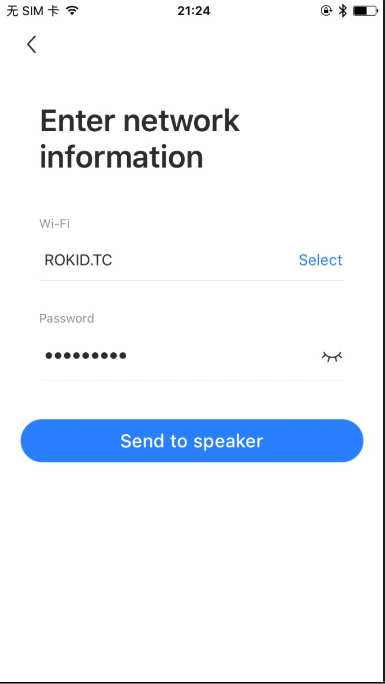

# 功能演示说明
本章主要说明AVS的主要功能，AVS的功能是设备通过WI-FI链接网络之后。因此在正式开始说明AVS的功能之前，需要完成设备的蓝牙配网功能。下面演示的功能，是设备已经完成刷机并且启动后。
##  蓝牙配网
首先用户需要下载Rokid提供的参考客户端，APP下载链接:[Rokid App](https://fir.im/rokidalexadev)
该APP主要是给设备进行配网和Alexa的授权。如果要要要给设备添加技能，需要使用Alexa app:
[the Amazon Alexa App](https://www.amazon.com/gp/help/customer/display.html?nodeId=201602060)

下面一iOS客户为例，讲解蓝牙配网过程，Android手机类似。
1. 先在手机上打开蓝牙，同时将手机连接上可以上网的WI-FI热点。

2. 长按开发板麦克风按键，直到语音提示蓝牙打开

3. 打开手机客户端，发现设备，设备名称是“Me-000006”，后面6位数字是设备序列号的后6位。

   

4. 点击连接按钮，设备语音提示蓝牙已经连接，手机跳转到配置WI-FI的页面，设置好WI-FI的SSID和PASSWORD，从手机发送到设备，设备今日Wi-Fi配置状态。

   

5. 等待设备返回Wi-Fi配置结果，如果Wi-Fi配置成功，会进入Alexa到授权状态。如果返回出错，查询错误状态。


## alexa授权
1. Wi-Fi配置成功后，客户端进入到alexa授权状态

   

2. 跳转到亚马逊官方网站上，填写自己在亚马逊上注册的账号。你可以使用rokid创建的账号amazon@Rokid.com, 密码：123456. 你也可以自己创建自己的账号，注册自己的设备类型。参考链接：[Create Security Profile](https://github.com/alexa/avs-device-sdk/wiki/Create-Security-Profile)

   

   

3. 如果授权成功，客户提示“Welcome Alexa”。其他状态是出错了。

   

## 关键词语音唤醒
设备授权通过后，用户可以通过“Alexa”关键词唤醒设备。设备唤醒后，会有灯效和语音提示。唤醒的灯效是带唤醒角度的。灯效如下：


## 按键唤醒
设备授权通过后，用户也可以通过短按power键唤醒设备，这个时候灯效是不带唤醒角度的，语音提示也和语音唤醒不一样。

## 语音交互
设备唤醒之后，用户就可以继续和Alexa进行语音对话了，Alexa进入LISTENING状态，例如用户在喊出“What's your name？”，这句话结束后，Alexa自动判断说话结束，进入THINKING状态，如果内容别识别了，设备会播放Alexa的返回的语音，设备进入SPEAKING状态，灯效展示。设备进入到SPEAKING的状态或者IDLE状态的时候，用户可以用语音和按键唤醒的方式随时打算正在播放声音。当用户说话的内容完全不能被识别的时候，会直接进入IDLE状态，IDLE状态是没有灯光展示的。

- IDLE 状态灯效

  

- LISTENING 状态灯效

  

- THINKING 状态灯效

  

- SPEAKING 状态灯效

  

- 典型功能呢演示，尝试“Alexa”唤醒开发板或者电源键唤醒。尝试下面的语音交互。

  1、"What's your name?"

  2、"What's the weather today?"

  3、"play music"

  查看灯光效果和提示声音以及回复的语音信息。

## 音量大小调节

用户可以通过开发板上的物理按键去调节音量大小，也可以通过语音交互的方式调节音量大小。物理按键和语音调节音量大小都会有灯效提示和语音提示。你可以在通过唤醒alexa之后， 通过语音交互“volum 5”，数字从1到10，进行音量的调节。

音量大小调节的灯效如下图：


## 关闭打开麦克风

用户通过短按开发板的麦克风按键实现关闭和打开麦克风功能。打开麦克风的时候， 没有灯效，只有短暂的提示声音。关闭麦克风，有语音提示，灯效是红色，一直显示红色。麦克风关闭后，alexa将不会接收语音唤醒和对话。


## 报警、提醒和定时器

对设备

## 通知功能

暂无

## ota升级

演示ota升级功能， 用户首先需要在源码目录编译产生ota升级包：

```shell
#./build.sh -p yodaos_k18_universal_avs -j20 -r
```

将升级包部署到远程平台上， 设备每次开机连上网络后就会检查升级包，如果有升级包就会下载升级包，如果升级包下载校验通过，就会启动本地升级，设备重启。如果要停用事情功能，可以用adb登陆设备，执行下面的命令：

```shell
#/etc/init.d/ota stop
```

或者将ota启动脚本中的启动命令注释掉：

```shell
#vi /etc/init.d/ota
 #!/bin/sh /etc/rc.common                                                                                                                                      
   # Copyright (C) 2011 OpenWrt.org
    
   START=96
   USE_PROCD=1
  # PROG=/usr/bin/yimo-ota
    
   start_service() {
       procd_open_instance
       procd_set_param command $PROG
       procd_set_param respawn 3600 2 -1
       procd_set_param stdout 1
       procd_set_param stderr 1
       [ -e /etc/coredump ] && {
           procd_set_param limits core="unlimited"
       }
       procd_close_instance
  }
```

这样设备重启后就不会再启动ota啦，不再自动升级。目前启动系统默认启动升级流程。

**查看设备是否正常升级？**

- 设备在没联网之前，查询设备当前的版本号（串口通过adb登陆设备）

  ```shell
  $getprop
  [ro.boot.btmac]: []
  [ro.boot.devicetypeid]: [0ABA0AA4F71949C4A3FB0418BF025113]
  [ro.boot.firstboot]: [1]
  [ro.boot.ftm]: []
  [ro.boot.hardware]: [kamino]
  [ro.boot.rokidseed]: [7b4ox152I2gHK9n28f1G359Q1unJ0y]
  [ro.boot.serialno]: [0503051829000001]
  [ro.boot.usid]: [1234567890]
  [ro.boot.wifimac]: []
  [ro.build.version.release]: [7.29.4-20190131-145857]
  [ro.capability.battery]: [false]
  [ro.product.locale]: [zh-CN]
  [ro.rokid.build.nativesystem]: [7.30.10]
  [ro.rokid.build.os]: [yodaos]
  [ro.rokid.build.platform]: [linux]
  [ro.rokid.build.productname]: [Rokid-Devkit]
  [ro.rokid.build.turen]: [3174378]
  [ro.rokid.build.vsp]: [057557e]
  [ro.rokid.build.yodaos]: [undefined]
  [ro.rokid.captureid]: [3]
  [ro.rokid.device]: [kamino_universal]
  [ro.rokid.playid]: [2]
  [service.adb.tcp.port]: [5555]7.29.4-20190131-145857

  ```
 ro.build.version.release 是设备版本号字段。设备连接上Wi-Fi之后，等到设备自动重启后，再查看版本信息，如果版本信息有更新，说明设备自动升级成功。
