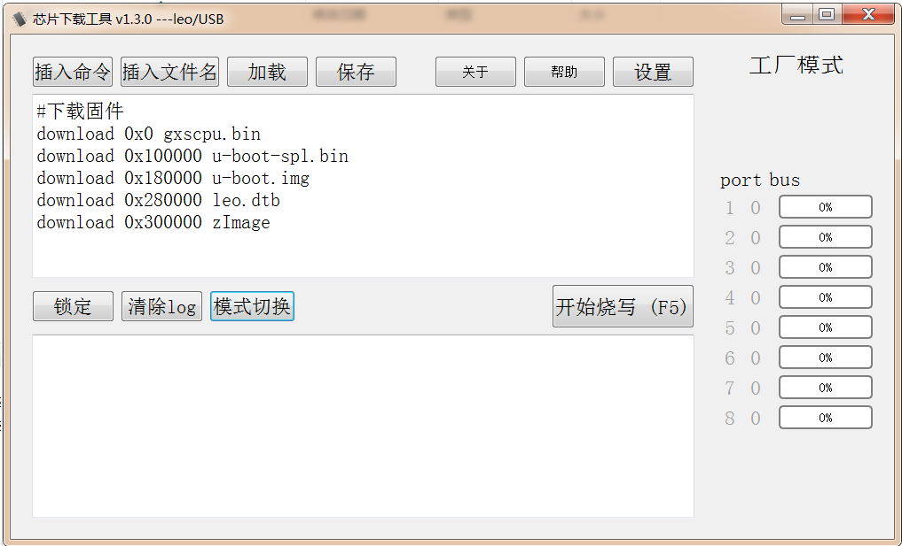
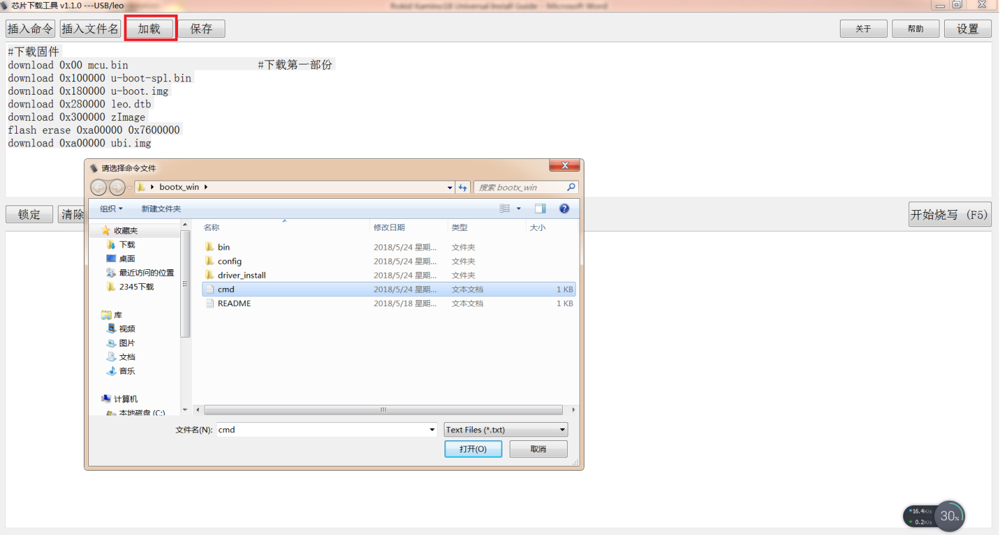
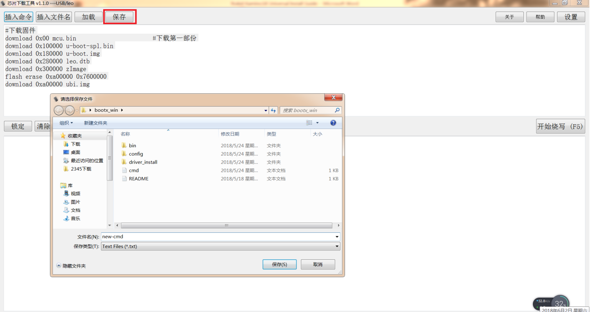
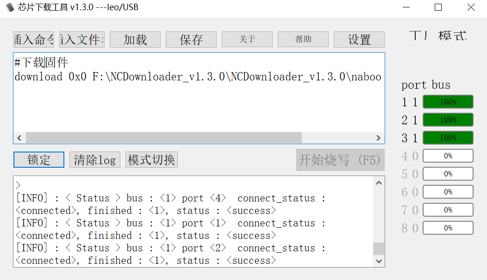

## 工厂烧写工具使用

工厂烧写工具是一个带UI界面的windows烧写工具，对于一台新电脑需要安装usb驱动（驱动安装文件和说明在leo-k18-universal-glibc/bootx_win/driver_install目录下），同时把需要烧写的镜像复制到bootx_win目录下，如下图所示：

该工具最多支持同时烧写8台Kamino18的设备端，运行烧写工具NCDownloader,显示界面如下：

位于上方的输入框是烧写命令列表栏，下方的输出框是烧写log输出栏。我们可以自己输入烧写命令，也可以从命令文件载入烧写命令，另外可以把烧写命令列表栏中的命令保存到命令文件中。如下两图所示：

同Linux电脑烧写过程类似，按住调试板上的BOOT_KEY，然后连接USB线到PC上，然后点击烧写工具的“开始烧写”按钮，完成烧写过程如下：

Note：

烧写命令列表栏中的download offset需要同uboot中设定的各分区的offset一致。