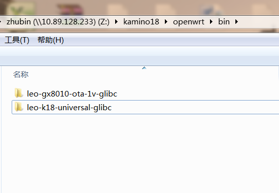

## 镜像位置

当系统镜像用build.sh完整编译完成后在$(K18DIR)/openwrt/bin/目录中会生成两个目录，如下图所示：

leo-k18-universal-glibc/full_images目录中包含系统烧写所需全部镜像，以及Linux或Windows电脑上用的烧写工具。leo-gx8010-ota-1v-glibc目录中包含recovery镜像，最终recovery镜像也会被包含在leo-k18-universal-glibc/full_images目录中。

leo-k18-universal-glibc/full_images目录中各文件的含义如下表：

| **文件名** | **文件用途** |
| --- | --- |
| bootmusic.wav | 启动音乐文件 |
| bootx | Linux电脑烧写工具可执行文件 |
| bootx.exe | Windows电脑烧写工具可执行文件 |
| download.bat | Windows电脑刷机脚本 |
| download.sh | Linux电脑刷机脚本 |
| mcu.bin | MCU分区镜像 |
| openwrt-leo-k18-universal.dtb | Kernel device tree blob分区镜像 |
| openwrt-leo-k18-universal-app.img | Data分区app镜像 |
| openwrt-leo-k18-universal-squashfs.img | 无用 |
| openwrt-leo-k18-universal-ubi.img | Rootfs分区ubi镜像 |
| openwrt-leo-k18-universal-u-boot.img | Uboot分区镜像 |
| openwrt-leo-k18-universal-u-boot-spl.bin | Spl分区镜像 |
| openwrt-leo-k18-universal-zImage | Kernel分区镜像 |
| openwrt-leo-ota-fit-uImage-initramfs.itb | Recovery分区镜像 |
| rokid-openwrt-leo-k18-universal-7.26.0-20181024-121845-ota.img | Ota全包升级镜像 |
| md5sum.txt | Ota全包升级镜像MD5值 |
| rokid-openwrt-leo-k18-universal-7.26.0-20181024-121845-upgrade.img | 不用 |