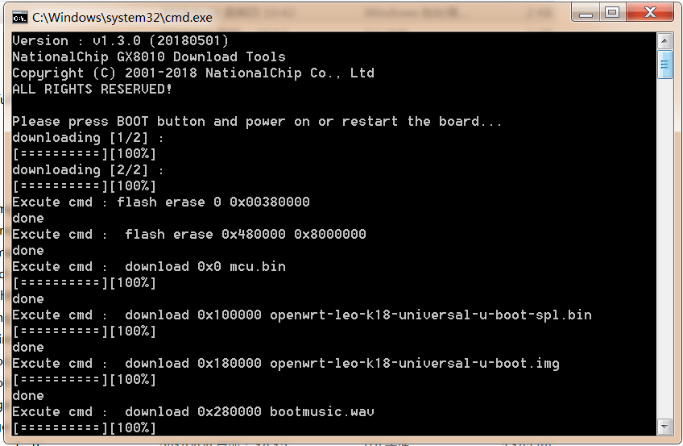

## Windows烧写工具使用 {#windows}

使用windows烧写工具前，对于一台新电脑需要安装usb驱动（驱动安装文件和说明在leo-k18-universal-glibc/bootx_win/driver_install目录下）,Windows电脑上具体烧写流程如下：

*   进入$(K18DIR)/openwrt/bin/ leo-k18-universal-glibc /full_images目录
*   双击download.bat
*   根据提示按住调试板上的BOOT_KEY，然后连接USB线到PC上.

