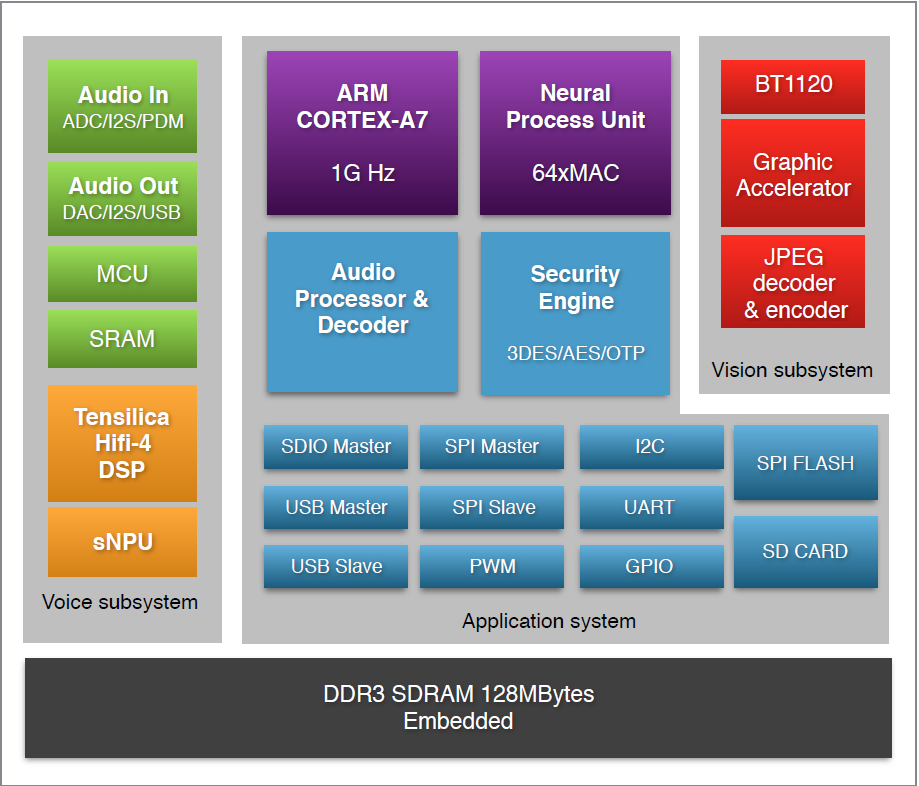

## 芯片框图

*   支持2/4/6/8路麦克风阵列
*   集成8通道ADC/I2S/PDM音频输入接口，支持模拟麦和数字麦
*   集成DAC/I2S音频输出接口，支持内部audio codec输出或外接audio codec输出
*   采用单MCU和单Cortex-A7的异步处理器架构，便于实现低功耗离线语音激活功能
*   内置DSP，支持降噪、AEC、Beam-forming、去混响等算法
*   内置NPU和SNPU, 主NPU由Cortex-A7控制，SNPU由MCU控制
*   内置BT1120接口，支持YUV格式的camera数据输入
*   内置SPI/I2C/USB/UART/PWM/SDIO等connectivity接口，支持集成WIFI/BT/LED等外围器件
*   内存配置：128MB SPI NAND Flash+内置128MB DDR