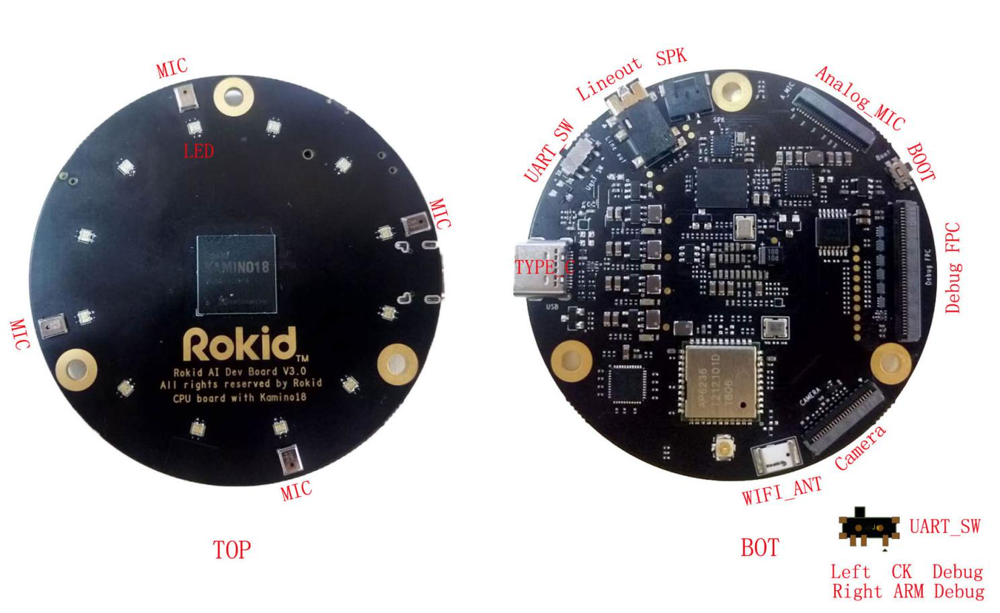
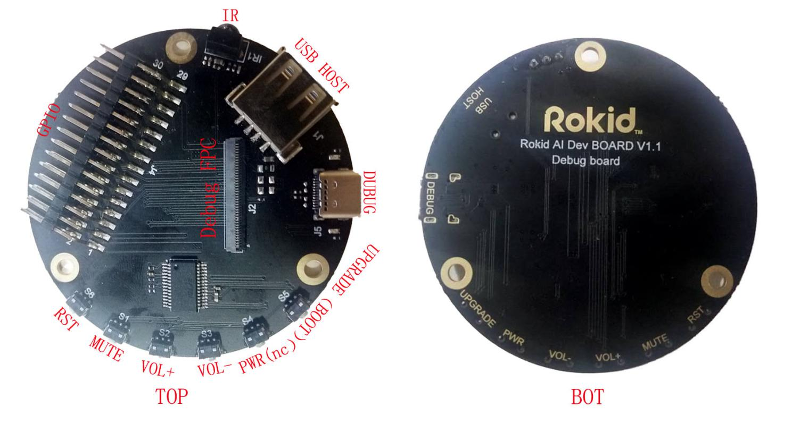
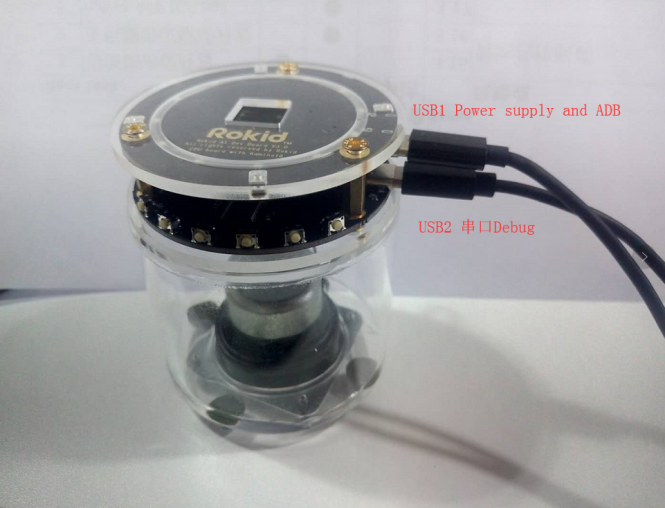
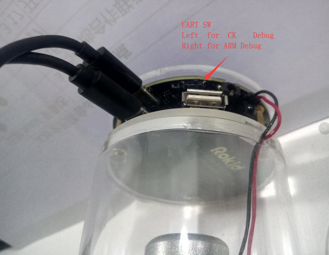

## 硬件开发板说明

Kamino18 Dev平台是面向智能语音应用而设计的硬件参考方案，分为主板和调试子板两部分。如下图所示：

**主板示意图**

1.  Lineout 立体声耳机输出口
2.  SPK Speaker 3.2w 4欧姆
3.  Analog_MIC 支持6路模拟MIC
4.  BOOT 升级按键
5.  Debug FPC 连接Debug板
6.  Camera 2M Camera(OV2640)
7.  WIFI ANT 板载陶瓷天线，可外接天线需要手工选贴电阻。
8.  TYPE_C 内含ADB debug,CK,ARM,调试串口（TTL电平）
9.  UART_SW SW 连接器，SW拔到左侧选择CK调试口,SW拔到右侧选择ARM调试口.
10.  LED 12PCS RGB LED
11.  MIC 4PCS PDM MIC

****

**调试子板示意图**

1.  IR 红外接收口
2.  USB HOST 可以外面USB设备
3.  DEBUG USB转串口调试口,USB线不提供电源。
4.  UPGRADE(BOOT) 按住按键写Image
5.  PWR(NC) 此按键为预留
6.  VOL- 音量减
7.  VOL+ 音量加
8.  MUTE 麦克静音
9.  RST 系统复位
10.  GPIO 外接GPIO 型号定义参考原理图

 

**USB线连接说明图**

1.  USB1 power supply and ADB,
2.  USB2 串口Debug,一端接Debug一端接PC,需要在PC端按装FT232驱动。UART SW

Left for CK Debug ,Right for ARM Debug.USB2不能给开发板提供电源。

**说明：**

*   主板上有4个PDM 接口的MEMS MIC, 12个RGB 3色LED；
*   主板上的TYPEC口， 连接信号包含 USB信号，CK UART信号，ARM UART信号，BOOT_KEY信号。按下BOOT_KEY，可用于烧写镜像。也可以通过标准TPYEC线连接电脑用于ADB调试和供电，建议最好用适配器给开发板供电，因AUDIO SPK功率比较大；如果音量调节比较小可以用USB供电。
*   调试子板上另一个TYPEC口，只提供USB信号不供电。通过标准TYPEC线连接PC；