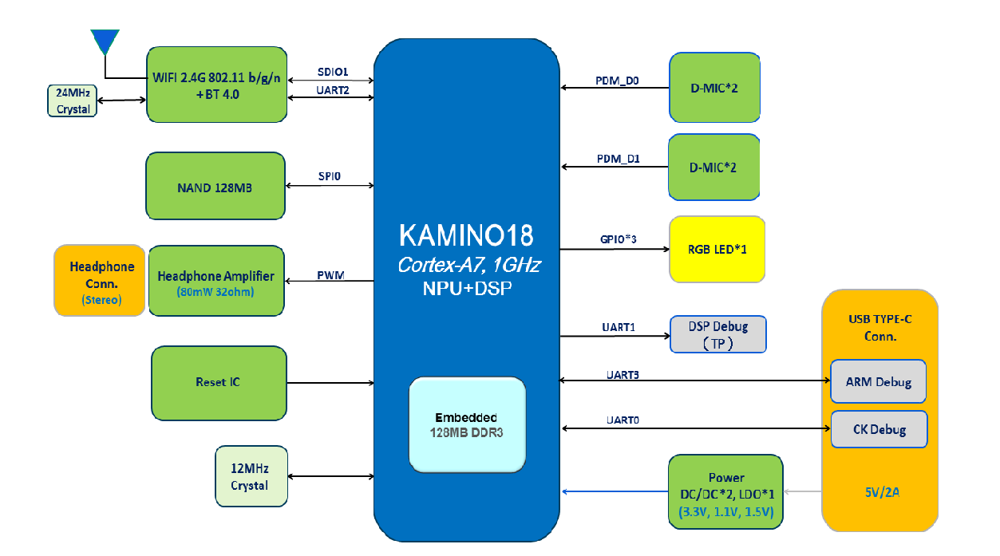

## 智能语音方案设计简介

*   电源：锂电池（便携模式）, 5V/2A,5V/1A AC/DC电源适配器（普通模式）或PC USB接口供电
*   存储器：SPI NAND Flash单颗1GBit~2GBit
*   音频：Audio Right/Left，模拟音频输出
*   MIC阵列：支持最高8路模拟MIC输入，支持单端和差分模式，每路自带BIAS电源
*   Connectivity：支持SDIO接入WIFI模块，UART接入BT模块
*   USB：一路USB2.0 HOST接口，一路USB2.0 Slave接口
*   操作系统：YODAOS（基于Linux内核）
*   云平台：默认对接Rokid语音云平台，也可对接第三方语音云平台
*   低功耗设计：支持Voice subsystem(MCU+DSP)上运行的低功耗离线语音激活模型