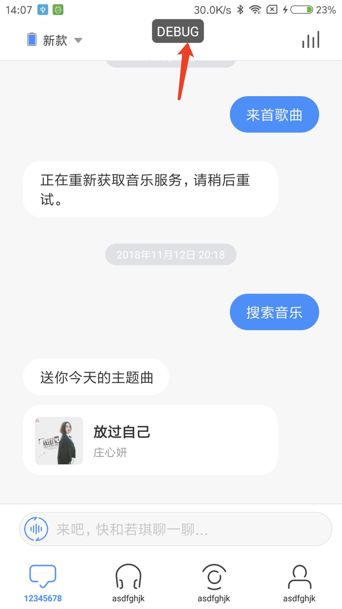
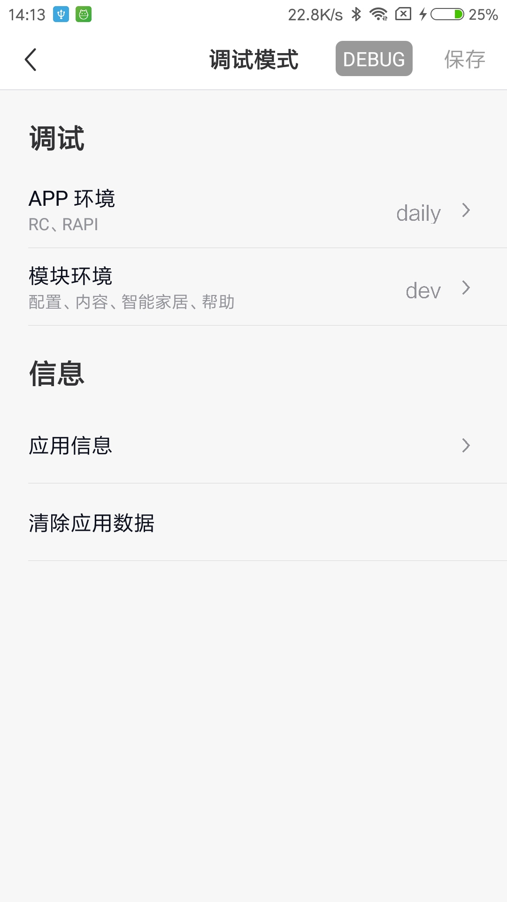
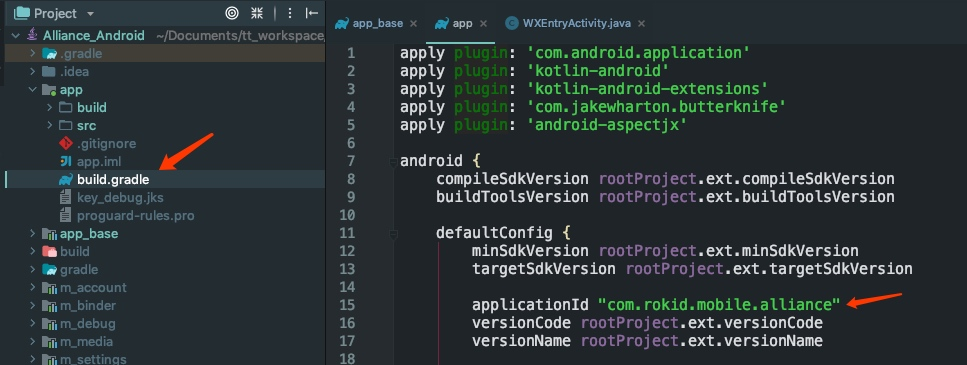
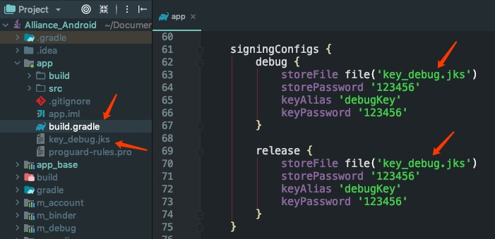
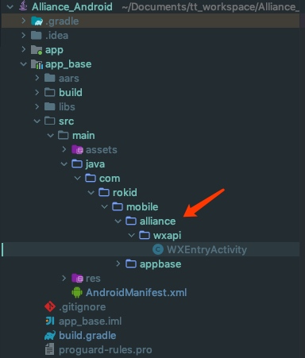

# 四、注意事项

相关配置完成后，如果厂商还有一些自定义需求，比如切换环境，接入第三方授权 SDK等，还需要在工程中继续修改相关文件。

## 4.1 APP 环境切换

公版 APP 分为了测试环境和正式环境，二者的区别是：在测试环境下，APP 的所有请求接口均是请求的测试服务器，一般是开发测试过程使用该环境；而在正式环境下，APP 的所有请求接口均是请求的正式服务器，即线上环境。厂商在开发阶段可以根据需要进行切换。
公版 APP 的环境切换入口是一个悬浮窗，如图：
<div align=center>

APP 环境切换入口
</div>
APP 相关配置完成后，第一次运行时，默认的环境是线上的，即正式服的，是看不到切换环境的入口悬浮窗的，如果需要切换到测试环境，需要先进入手机的设置里面，找到公版 APP（若琪联盟 开发），然后开启悬浮窗权限，设置完成后重启公版 APP，即可看见。点击图标，会显示当前的开发环境，如图：

<div align=center>

APP 环境切换页面
</div>

如果要切换成测试环境，只需点击 **APP 环境** 选项，在选择框中选择 **daily**，点击右上角保存按钮，APP 会自动重启，启动完成后 APP 即切换成了测试环境。切换回正式环境操作一样。
## 4.2 微信 SDK 接入
如果厂商需要接入微信 SDK 授权，厂商需要先到微信开发平台去申请对应的 ID 和 Secret 等数据，期间需要用到公版 APP 工程的 **ApplicationId** 和工程的签名，厂商在进行相关操作时，需先替换掉公版 APP 工程的默认 **ApplicationId** 以及换掉工程默认的签名，然后再去微信开发平台进行注册，不然在进行微信登录授权时会发生异常。

* 具体的微信 SDK 集成操作可以参考微信 SDK 官网和相关文档：https://open.weixin.qq.com/cgi-bin/showdocument?action=dir_list&t=resource/res_list&verify=1&id=1417751808&token=&lang=zh_CN 
* 安卓工程签名相关说明可以参考：https://developer.android.com/studio/publish/app-signing?hl=zh-cn 

工程 **ApplicationId** 的设置在 **app** -> **build.gradle** 文件中：
<div align=center>

applicationId 所在文件位置
</div>
<div align=center>

工程默认签名
</div>

如果修改了默认的 **applicationId**，需要将微信授权的承载页面 **WXEntryActivity** 移动到对应的包下，否则在进行微信授权时会发生异常。比如将默认的

```java
        applicationId "com.rokid.mobile.alliance"
```
修改为

```java
        applicationId "com.rokid.mobile.abc"
```
那么就需要将默认在 **com.rokid.mobile.alliance** 包中的 **wxapi** 文件直接移动到 **com.rokid.mobile.abc** 包中。**wxapi** 不能修改，**WXEntryActivity** 必须在该文件中。
<div align=center>

WXEntryActivity 所在文件位置
</div>

