# 基础信息配置

在运行或编译工程前，需要根据厂商的需求填写一些基础的配置信息，具体如下：

## 3.1 配置 APP 基础信息

APP 基础信息主要包括了：

* 设备的唤醒词
* 设备的蓝牙前缀
* 各界面时需要用到的路由跳转 schema 和 action
* Webview 页面的 uri
* APP clientId 和 Secret
* 日志库标识
* QQ 音乐授权 ID
* 微信授权 ID
* 喜马拉雅 SDK 初始化时当前工程包名
* 喜马拉雅测试服/正式服授权 AppKey 和 Secret
* 京东微联测试服/正式服授权 AppKey
* 米家授权 AppID

该文件存在于 app_base -> src -> java -> com.rokid.mobile -> appbase 目录下，类名为 RokidConfig，找到该文件后双击打开：

<div align=center>
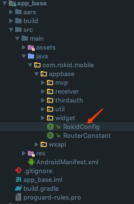
</div>

厂商根据自身的需求，依次填写相关需要的数据信息，其中必填项信息必须填写具体的值，非必填项信息可以为空：

```java
    /**
     * 默认唤醒词，如 ”若琪“，必填项
     */
    String VENDOR_NAME = "your VENDOR_NAME";

    /**
     * 配网蓝牙前缀，如 ”Rokid“
     */
    String VENDOR_BLE_PREFIX = "your VENDOR_BLE_PREFIX";

    /**
     * 路由 Scheme，如 ”rokid“，必填项
     */
    String ROUTER_SCHEME = "your ROUTER_SCHEME";

    /**
     * 路由 Action，如 "com.rokid.action.ROUTER"，必填项
     */
    String ROUTER_ACTION = "your ROUTER_ACTION";

    /**
     * WebView 容器，如 "rokid://webview/index"，必填项
     */
    String ROUTER_WEBVIEW_URI = "your ROUTER_WEBVIEW_URI";

    /**
     * APP ClientId，必填项
     */
    String CLIENT_ID = "your CLIENT_ID";

    /**
     * APP Client_Secret，必填项
     */
    String CLIENT_SECRET = "your CLIENT_SECRET";

    /**
     * 日志库，必填项
     */
    String LOG_PROJECT = "your LOG_PROJECT";
```

| Config Key | 含义 | 必须 | 说明 |
| --- | --- | --- | --- |
| VENDOR_NAME | 默认唤醒词 | 是  |  公版 APP 中的默认值是 ”若琪“，厂商设置成自有的设备名称后，会自动替换掉整个 APP 中的 UI 层面的所有”若琪“|
| VENDOR_BLE_PREFIX | 配网蓝牙前缀 | 是  |  公版 APP 中的默认值是 ”Rokid“，厂商设置成自有的设备蓝牙前缀后，配网时 APP 就会自动搜索以该蓝牙前缀开头的所有设备|
| ROUTER_SCHEME | 路由 Scheme | 是  |  公版 APP 中的所有的页面跳转均是隐式跳转，需要根据具体的 uri 进行页面间的跳转，默认值是 ”rokidalliance“，厂商设置成自有的 schema 后，APP 会自动替换整个路由表的 schema|
| ROUTER_ACTION | 路由 Action | 是  |  公版 APP 中的所有的页面跳转均是隐式跳转，需要根据具体的 uri 进行页面间的跳转，默认值是 ”com.rokidalliance.action.ROUTER"，厂商设置成自有的 action 后，APP 会自动替换整个路由表的 action|
| ROUTER_WEBVIEW_URI | WebView 容器 | 是  |  公版 APP 中的所有的页面跳转均是隐式跳转，需要根据具体的 uri 进行页面间的跳转，默认值是 ”rokidalliance://webview/index"(schema 是 rokid，)，厂商设置成自有的 WebView uri 后，APP 会自动替换整个路由表的 WebView uri|
| CLIENT_ID | APP ClientId | 是  |从若琪开放平台获取的 ClientId |
| CLIENT_SECRET | APP CLIENT_SECRET | 是  |从若琪开放平台获取的 ClientSecret |
| LOG_PROJECT | 日志库标识 | 是  |用于相关 log 上传的标识|

<font color=red>替换 **ROUTER_SCHEME** 注意事项：</font>
在替换全局路由 **ROUTER_SCHEME** 的值后，还需全局替换工程中所有 **AndroidManifest.xml** 文件中所有 **Activity** **intent-filter** 中的 **data** 的 **android:scheme**"。比如：
<center class="half">
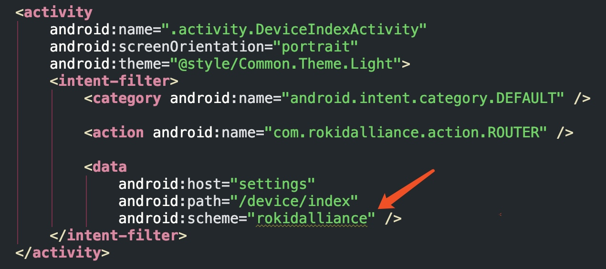
    AndroidManifest 文件
</center>
替换时可以先选中如下代码

```
android:scheme="rokidalliance"
```
然后按下键盘上的 **command** + **shift** + **R** 键，即可开启全局替换的窗口，如图：
<div align=center>
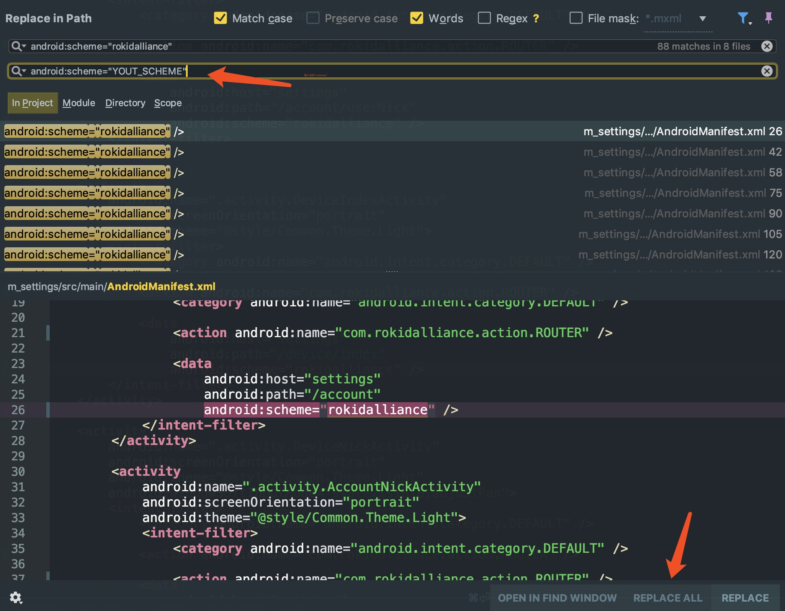
</div>
输入你的 **scheme** 后，点击 **REPLACE ALL** 即可全局替换掉整个工程的 **scheme**。

## 3.2 配置 APP 主题颜色
公版 APP 现在主要用到的颜色有以下 7 类主要颜色：

* 透明
* 白色
* 蓝色
* 黑色
* 灰色
* 黄色
* 红色

具体的色值文件存在于 app_base -> src -> java -> com.rokid.mobile -> appbase 目录下，类名为 RokidConfig，找到该文件后双击打开：

```java
    <!--透明-->
    <color name="common_transparent">#00000000</color>

    <!--白色-->
    <color name="common_white">#FFFFFF</color>

    <!--蓝色-->
    <color name="rokid_main_color">#408CFF</color>
    <color name="common_bottom_btn_press_color">#387AE9</color>

    <!--黑色-->
    <color name="common_text_black_color">#323233</color>
    <color name="common_hint_color">#33000000</color>

    <!--灰色-->
    <color name="common_btn_unclickable">#DFE1E4</color>
    <color name="common_gray_text">#9A9A9A</color>
    <color name="common_gray_bg">#F7F7F7</color>
    <color name="common_titlebar_right_icon">#555556</color>

    <!--黄色-->
    <color name="device_battery_yellow">#FFA100</color>

    <!--红色-->
    <color name="common_red_text">#F90210</color>
    <color name="device_offline_bg">#FFF6F4</color>
    <color name="device_offline_top_bg">#FF7474</color>
```
具体颜色说明：

| color name | color 色值 | 说明 |
| --- | --- | --- |
|  common_transparent| #00000000 | 透明 |
|  common_white| #FFFFFF | 白色背景，白色字体 |
|  rokid_main_color| #408CFF | 主题色，输入框光标颜色，可点击文字颜色， TitleBar 右边按钮可点击状态时颜色，对话流 asr 卡片背景 ，底部可点击蓝色按钮背景色|
|  common_bottom_btn_press_color| #387AE9 | 蓝色按钮点击时的颜色 |
|  common_text_black_color| #323233 | 黑色字体，主标题，输入框文字颜色，输入框有焦点下划线颜色，TitleBar 左边按钮，TitleBar 标题文字颜色，验证码输入框颜色 |
|  common_hint_color| #33000000 | 输入框为空时提示文案的颜色 |
|  common_btn_unclickable| #DFE1E4 | 下划线默认颜色，输入框失去焦点下划线颜色、view 不可点击背景色，首页时间 card 背景色，切换设备背景色 |
|  common_gray_text| #9A9A9A | 灰色字体，副标题，输入框上的标题，输入框右边清除按钮颜色，输入框右边密码不可见按钮颜色 TitleBar 右边按钮不可点击颜色，切换设备——设备离线 icon 和文字颜色，列表item右边可点击icon |
|  common_gray_bg| #F7F7F7 | 输入框背景颜色，activity/fragment 灰色背景色，dialog 灰色背景色，首页对话流 card 背景色 |
|  common_titlebar_right_icon| #555556 | 顶部导航栏图标颜色（搜索 icon，播放器 icon） |
|  device_battery_yellow| #FFA100 | 设备电量值在 20-60时背景色 |
|  common_red_text| #F90210 | 电池电量低于20%背景色，设备card离线 “重新配网” 背景色和文字颜色 |
|  device_offline_bg| #FFF6F4 | 首页，畅听页，发现页底部设备离线背景色 |
|  device_offline_bg| #FF7474 | 设备设置页面设备离线背景色 |

以上 7 类颜色只是公版 APP 中默认的通用颜色，如果无法满足厂商的需求，厂商可根据自身设计的 APP 风格到对应页面的布局文件中替换为任一颜色。

## 3.2 配置设备配网信息
由于各厂商的设备信息会有差异，公版 APP 提供了一些配置文件用于配置各自设备的相关信息，这部分主要介绍用于设备配网相关页面的配置信息。

### 3.2.1 配网首页数据信息
配网首页的数据文件存在于 **app_base -> src -> main -> assets -> binder** 目录下，类名为 **config_binder_brief.json**，找到该文件后双击打开，配置信息是 json，具体格式如下：

```json
[
  {
  "binderType": "ble_bind", // 配网类型，支持："ble_bind", "ble_rebind"
  "isNew": true, // 是否为新品
  "linkUrl": "rokid://binder/bootGuide?type=Me", // 页面跳转的URL
  "blePrefix": "Rokid-Me-", // 设备蓝牙的名称前缀
  "imageUrl": "http://rokid.oss-cn-qingdao.aliyuncs.com/mobile-app/binder/img/home/me.png", // 设备预览图
  "deviceTypeName": "Me" // 设备名称
  },
  {
  "binderType": "ble_bind",
  "isNew": true,
  "linkUrl": "rokid://binder/bootGuide?type=Panda",
  "blePrefix": "Rokid-Panda-",
  "imageUrl": "http://rokid.oss-cn-qingdao.aliyuncs.com/mobile-app/binder/img/home/panda.png",
  "deviceTypeName": "Panda"
  }
 ]

```
相关字段具体说明如表格所示：

| key | 类型 | 说明 |
| --- | --- | --- |
| binderType | String | 配网类型，值：**ble_bind**——配网，**bel_rebind**——重新配网|
| isNew | boolean | 是否为新设备类型，true则表示为新设备，配网首页设备图片右上角则会增加一个icon |
| linkUrl | String | 点击配网首页某个设备后的跳转uri，需注意的是，uri 后面请拼上当前点击的设备类型，具体格式如：rokid://binder/bootGuide?type=Me，**type="YOUR_DEVICE_TYPE" 必须有，不可缺少**|
| blePrefix | String | 该设备类型的蓝牙前缀，具体格式如: Rokid-Me-|
| imageUrl | String | 当前设备预览图片的 url|
| deviceTypeName | String | 当前设备的名称|
不同厂商可根据当前拥有的设备个数，对如上的 json 数组进行增加或者删除，只要保证格式一致即可。

<div align=center>
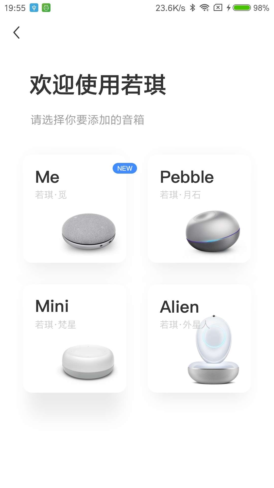
配网首页
</div>

### 3.2.2 具体某个设备类型配网数据信息
具体某个设备的配网信息也存在于 **app_base -> src -> main -> assets -> binder** 目录下， 每个设备类型对应一个 json 文件，以 Pebble 设备为例，在目录下会有**config_binder_detail_pebble.json**，找到该文件后双击打开，配置信息是 json，具体格式如下：

```json
 {
    "type": "ble_bind", // 配网类型，支持："ble_bind", "ble_rebind"
    "deviceTypeName": "Pebble", // 设备名称
    "isNew": false, // 是否为新品
    "linkUrl": "rokid://binder/bootGuide?type=Pebble", // 页面跳转的URL
    "blePrefix": "Rokid-Pebble-", // 设备蓝牙的名称前缀
    "imageUrl": "http://rokid.oss-cn-qingdao.aliyuncs.com/mobile-app/binder/img/home/pebble.png", // 设备预览图
    "support": {
        "is5GEnable": true, // 是否支持5g
        "tip": "",   // 哪些WiFi不支持的说明
        "helpButton": "",   // 帮助按钮的文字
        "connectButton": "发送到音箱" // 发送WiFi账号密码的按钮文案
    },
    "guide": { // 设备详情的指南页面的数据
        "title": "长按音箱顶部「O」键",  // 标题
        "subtitle": "大约1分钟后，你将听到音箱提示", // 副标题
        "description": "“为我完成网络配置”", // 描述信息
        "videoUrl": "https://s.rokidcdn.com/mobile-app/video/binder/pebble.mp4", // 配网操作的介绍视频，没有的话，会先显示下面的首帧图片
        "coverImageUrl": "https://s.rokidcdn.com/mobile-app/video/binder/pebble_first.png", // 介绍视频的首帧图片
        "usageHelper": { // 使用帮助相关信息
            "button": "查看帮助", // 对应点击的button文案
            "title": "没有听到配网提示音？", // 帮助页面 title
            "subtitle": "帮助若琪检查以下内容", // 帮助页面子 title
            "image": "http://rokid.oss-cn-qingdao.aliyuncs.com/mobile-app/binder/img/guide/pebble.png", // 帮助页面图片 URL
            "tips": [ // 帮助页面各条提示信息标题和文案
                     {
                     "title": "确认音箱已开机",
                     "text": "尝试点击顶部电源键「O」\n若有蓝色灯光亮起，则表示音箱已开机。\n若蓝色灯光没有亮起，请先开机：插上电源，长按电源键「O」，直到亮起蓝灯。"
                     },
                     {
                     "title": "双击音箱顶部「O」键",
                     "text": "音箱将提示：“为我完成网络配置”，并闪烁橙色灯光。"
                     }
                     ]
        },
        "noDeviceHelper": { // 没有找到设备的帮助相关信息
            "button": "已听到提示音",
            "title": "未找到可连接的音箱",
            "subtitle": "帮助若琪检查以下内容",
            "image": "http://rokid.oss-cn-qingdao.aliyuncs.com/mobile-app/binder/img/guide/pebble.png",
            "tips": [
                     {
                     "title": "确认音箱已开机",
                     "text": "尝试点击顶部电源键「O」\n若有蓝色灯光亮起，则表示音箱已开机。\n若蓝色灯光没有亮起，请先开机：插上电源，长按电源键「O」，直到亮起蓝灯。"
                     },
                     {
                     "title": "双击音箱顶部「O」键",
                     "text": "音箱将提示：“为我完成网络配置”，并闪烁橙色灯光。"
                     }
                     ]
        }
    },
    "progresses": [ // 配网的进度状态码以及进度控制
                   {
                   "doingCode": "10", // 正在进行的code
                   "doneCode": "11", // 完成的code
                   "doingText": "正在连接WiFi", // 正在进行的文案提示
                   "doneText": "音箱已成功联网" // 完成的文案提示
                   },
                   {
                   "doingCode": "100",
                   "doneCode": "101",
                   "doingText": "正在进行身份验证",
                   "doneText": "完成身份验证"
                   },
                   {
                   "doingCode": "200",
                   "doneCode": "201",
                   "doingText": "正在将设备绑定到你的账号",
                   "doneText": "设备和账号绑定成功"
                   }
                   ],
    "errors": [ // 配网的错误状态码以及进度控制
               {
               "code": "-11", // 错误码
               "subtitle": "Wi-Fi 密码不正确", // 配网错误页面副标题
               "tips": [
                        "请检查 Wi-Fi 或热点账号密码是否正确" // 出错是设备的提示信息
                        ]
               },
               {
               "code": "-12",
               "subtitle": "Wi-Fi 连接异常",
               "tips": [
                        "请检查 Wi-Fi 或热点账号密码是否正确"
                        ]
               },
               {
               "code": "-13",
               "subtitle": "没有找到该网络，请检查后重试",
               "tips": [
                        "请检查 Wi-Fi 或热点账号密码是否正确"
                        ]
               },
               {
               "code": "-14",
               "subtitle": "密码长度不正确",
               "tips": [
                        "请检查 Wi-Fi 或热点账号密码是否正确"
                        ]
               },
               {
               "code": "-99",
               "subtitle": "Wi-Fi 连接异常",
               "tips": [
                        "尝试将音箱放在离路由器更近的地方",
                        "请检查 Wi-Fi 或热点账号密码是否正确",
                        "保持手机网络正常"
                        ]
               },
               {
               "code": "-101",
               "subtitle": "Wi-Fi 连接异常",
               "tips": [
                        "尝试将音箱放在离路由器更近的地方",
                        "请检查 Wi-Fi 或热点账号密码是否正确",
                        "保持手机网络正常"
                        ]
               },
               {
               "code": "-201",
               "subtitle": "其他，或我也不确定",
               "tips": [
                        "尝试将音箱放在离路由器更近的地方",
                        "请检查 Wi-Fi 或热点账号密码是否正确",
                        "保持手机网络正常"
                        ]
               },
               {
               "code": "-1000",
               "subtitle": "Wi-Fi 连接异常",
               "tips": [
                        "尝试将音箱放在离路由器更近的地方",
                        "请检查 Wi-Fi 或热点是否正常"
                        ]
               },
               {
               "code": "-1001",
               "subtitle": "手机网络连接异常",
               "tips": [
                        "请检查手机网络状态"
                        ]
               }
               ]
}
```
相关字段具体说明如表格所示：

| key | 类型 | 说明 |
| --- | --- | --- |
| type | String | 配网类型，值：**ble_bind**——配网，**bel_rebind**——重新配网|
| deviceTypeName | String | 当前设备的名称|
| isNew | boolean | 是否为新设备类型，true则表示为新设备，配网首页设备图片右上角则会增加一个icon |
| linkUrl | String | 点击配网首页某个设备后的跳转uri，需注意的是，uri 后面请拼上当前点击的设备类型，具体格式如：rokid://binder/bootGuide?type=Me|
| blePrefix | String | 该设备类型的蓝牙前缀，具体格式如: Rokid-Me-|
| imageUrl | String | 当前设备预览图片的 url|
| support | Object | 是否支持 5G 网络相关数据信息|
| guide | Object | 搜索设备蓝牙相关页面时的显示文案数据信息|
| progresses | Object | 配网的进度状态码以及进度控制数据信息|
| errors | Object | 配网的错误状态码以及进度控制数据信息|

#### 3.2.2.1 “support” 相关字段说明：
该数据主要用于 APP 中的发送 wifi 信息界面，对应的 Activity 是 **WifiSettingsActivity**。

| key | 类型 | 说明 |
| --- | --- | --- |
| is5GEnable | boolean | 该设备类型是否支持 5G 网络|
| tip | String | 不支持 5G 网络的提示文案|
| helpButton | String | 帮助按钮的文案 |
| connectButton | String | 发送WiFi账号密码的按钮文案 |
<div align=center>
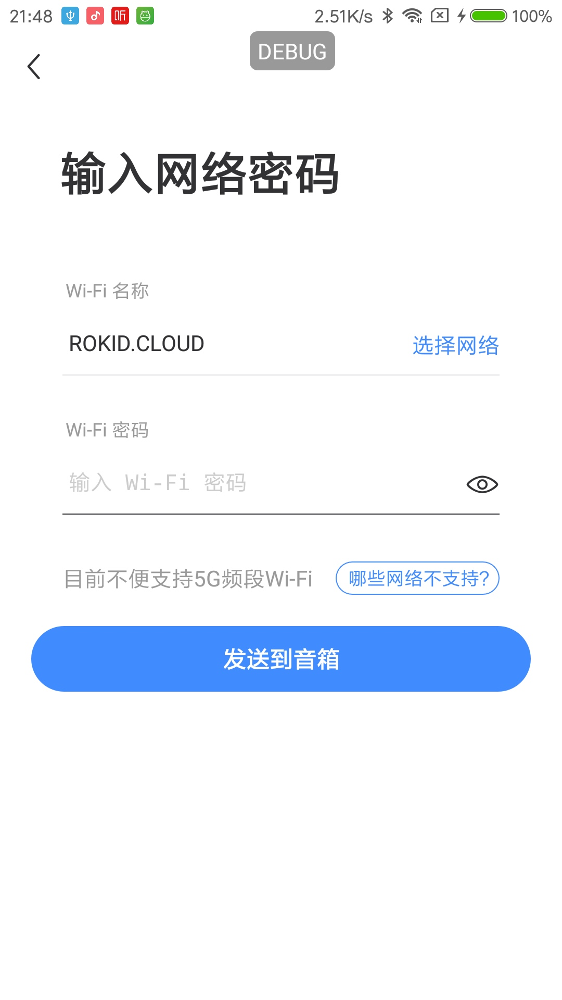
发送 wifi 信息界面
</div>

#### 3.2.2.2 “guide” 相关字段说明：
该数据主要用于 APP 中的单个设备搜索蓝牙和对应的两个帮助界面，对应的 Activity 是 **BinderSearchDeviceBleActivity**、**BinderPromptHelpActivity** 和 **BinderNetworkHelpActivity**。

| key | 类型 | 说明 |
| --- | --- | --- |
| title | String | BinderSearchDeviceBleActivity 页面标题|
| subtitle | String | BinderSearchDeviceBleActivity 页面子标题|
| description | String | BinderSearchDeviceBleActivity 页面描述信息 |
| videoUrl | String | BinderSearchDeviceBleActivity 页面视频 URL |
| coverImageUrl | String | BinderSearchDeviceBleActivity 页面视频第一帧图片 URL|
| usageHelper | Object | 没有听到配网提示音的帮助页面数据信息，对应 **BinderPromptHelpActivity**|
| noDeviceHelper | Object | 没有找到可连接的音箱帮助页面数据信息，对应 **BinderNetworkHelpActivity**|
<center class="half">
    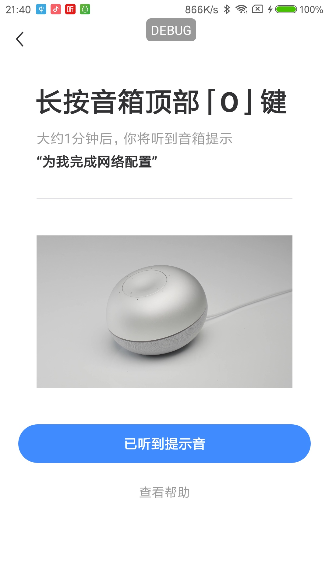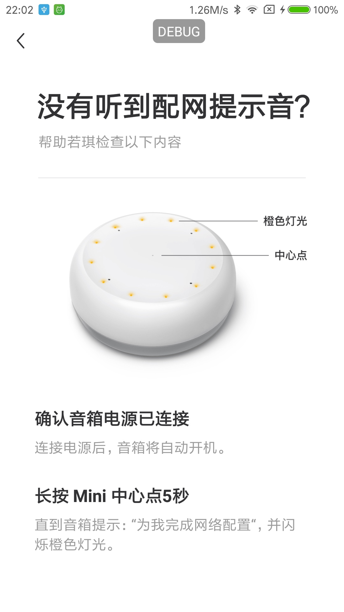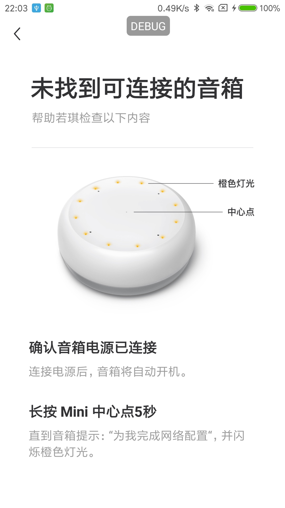
    具体某个设备类型配网首页和帮助页
</center>

#### 3.2.2.3 “progresses” 相关字段说明：
该数据主要用于 APP 中配网过程中相关页面的信息展示，对应的 Activity 是 **BindStatusActivity**。

| key | 类型 | 说明 |
| --- | --- | --- |
| doingCode | String | 当前步骤准备进行的 code|
| doneCode | String | 当前步骤完成时的 code|
| doingText | String | 当前步骤准备进行时的文案 |
| doneText | String | 当前步骤完成时的文案 |

具体的 code 状态值如下：

| 状态值 | 说明 |
| --- | --- | --- |
| 10 | wifi连接中 |
| 11 | wifi连接成功 |
| -11 | wifi密码错误 |
| -12 | wifi连接超时 |
| -13 | 没找到当前wifi |
| -14 | wifi密码长度不正确 |
| -98 | 运营商网络错误 |
| 100 | 登录中 |
| 101 | 登录成功 |
| -101 | 登录失败 |
| 200 | 绑定中 |
| 201 | 绑定成功 |
| -201 | 绑定失败 |
<div align=center>
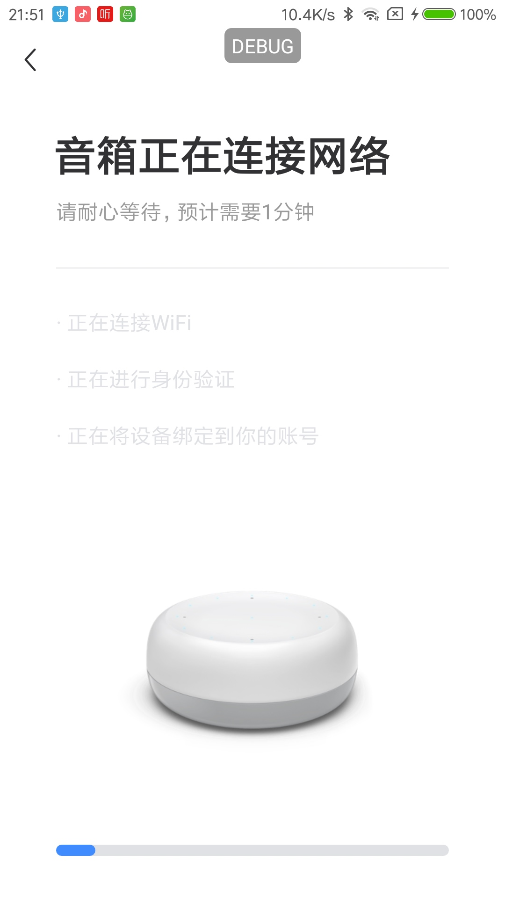
设备正在配网中页面
</div>

#### 3.2.2.4 “errors” 相关字段说明：
该数据主要用于 APP 中配网过程中发生异常时的信息展示，对应的 Activity 是 **BinderConnectErrorHelpActivity** 和 **BinderConfirmErrorStateActivity**。

| key | 类型 | 说明 |
| --- | --- | --- |
| code | String | 配网失败的错误码|
| subtitle | String | 配网错误页面副标题|
| tips | Object | 配网错误页面相关的提示信息数据 |
需注意的是，该配置文件命名的通用格式为： **config_binder_detail_"deviceTypeN
ame".json**，厂商在设置自己的设备时，只需修改具体的设备类型名称即可，例如你有个设备类型名称叫做 “ABC”，那么对应的文件名称为 **config_binder_detail_ABC.json**，“**config_binder_detail_**”保持不变。同时，一个配置文件对应一个设备类型，若有多个设备类型，则添加对应数量的配置文件即可。
<center class="half">
    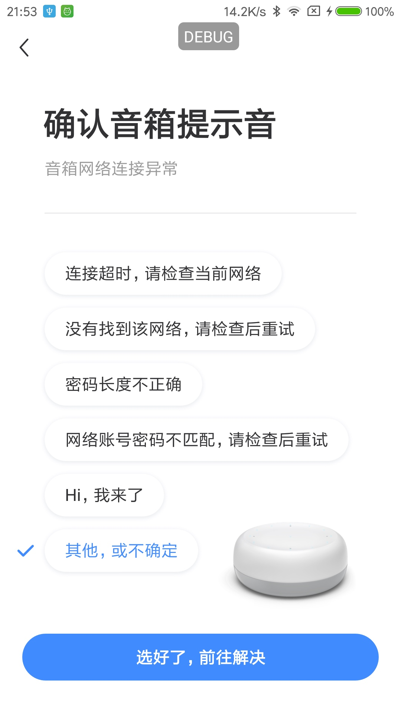
    设备配网失败页面
</center>

## 3.3 配置设备设置项信息
不同的设备可能会有不同的设置项，为了方便厂商适配各自的设备，公版 APP 也提供了一些配置文件来设置各个设备的具体设置项信息。

### 3.3.1 “我的”页面设置项列表数据配置
公版 APP 在“我的”页面默认设置了 6 项主要且通用的设置信息，如需修改，请到 **app_base -> src -> main -> assets -> settings** 目录下找到 **config_settingIndex.json** 和 **config_settingIndex_daily.json** 文件，二者分别对应的是正式服的设置项和测试服的设置项，该数据对应的类是**SettingsIndexFragment**， 具体的格式如下：

```json
[
  {
    "settingIndexConfigList": [
      {
        "id": 1,
        "groupId": "1000",
        "name": "设备管理",
        "type": "deivceManage",
        "iconUrl": "https://s.rokidcdn.com/app/setting_index/settings_device_manage.png",
        "linkUrl": "rokid://settings/device_list",
        "enabled": true,
        "version": "1.0.0"
      },
      {
        "id": 2,
        "groupId": "1000",
        "name": "设备升级",
        "type": "deviceUpdateAll",
        "iconUrl": "https://s.rokidcdn.com/app/setting_index/settings_update.png",
        "linkUrl": "rokid://settings/device_update_all",
        "enabled": true,
        "version": "1.0.0"
      },
      {
        "id": 3,
        "groupId": "1000",
        "name": "房间管理",
        "type": "roomManage",
        "iconUrl": "https://s.rokidcdn.com/app/setting_index/settings_room_manage.png",
        "linkUrl": "https://s.rokidcdn.com/homebase/rokid$env$/index.html#homes/defaultHomeId/rooms",
        "enabled": true,
        "version": "1.0.0"
      },
      {
        "id": 4,
        "groupId": "1000",
        "name": "智能家居",
        "type": "sceneIndex",
        "iconUrl": "https://s.rokidcdn.com/app/setting_index/settings_mine_scene.png",
        "linkUrl": "https://s.rokidcdn.com/homebase/tob/index.html#/homes/index",
        "enabled": true,
        "version": "1.0.0"
      }
    ],
    "title": "",
    "groupId": "1000"
  },
  {
    "settingIndexConfigList": [
      {
        "id": 12,
        "groupId": "1002",
        "name": "使用帮助",
        "type": "useHelp",
        "iconUrl": "https://s.rokidcdn.com/app/setting_index/settings_help.png",
        "linkUrl": "rokid://help/index",
        "enabled": true,
        "version": "1.0.0"
      },
      {
        "id": 13,
        "groupId": "1002",
        "name": "联系我们",
        "type": "connectUs",
        "iconUrl": "https://s.rokidcdn.com/app/setting_index/settings_connect_us.png",
        "linkUrl": "rokid://settings/connectUs",
        "enabled": true,
        "version": "1.0.0"
      }
    ],
    "title": "",
    "groupId": "1002"
  }
]
```
设置项数据是按照组的形式来进行划分，具体的字段说明，如表格所示：

| key | 类型 | 说明 |
| --- | --- | --- |
| title | String | 每组设置项的标题 |
| groupId | String | 每组设置项的 Id|
| settingIndexConfigList | Object | 每组具体的设置项数据信息|

**“ settingIndexConfigList ”** 的具体格式如下：

| key | 类型 | 说明 |
| --- | --- | --- |
| id | String | 设置项 Id |
| groupId | String | 设置项所属的组的 Id|
| name | String | 设置项名称|
| type | String | 设置项类型|
| iconUrl | String | 设置项icon URL|
| linkUrl | String | 设置项点击后的跳转 URL，如果是跳转本地页面，url 请参照列子中的格式，必须要和跳转到的页面 url 一致，否则会找不到对应页面|
| enabled | Boolean | 默认为 true，扩展字段|
| version | String | 默认为 1.0.0，扩展字段|

<div align=center>
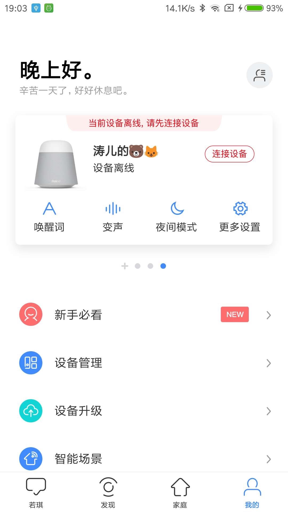
“我的”页面首页
</div>

### 3.3.2 具体某个设备类型设置项数据配置
不同的设备可能具有不同的设置项，为了方便厂商配置设备的具体设置项信息，公版 APP 也是通过配置文件来进行相关的设置，这部分数据主要是设备的卡片数据和该设备类型支持的全部设置项，配置这块数据需到 **app_base -> src -> main -> assets -> settings** 目录下找到 **config_deviceTypeInfo.json** 文件，文件具体格式如下：

```json
[
  {
    "typeId": "rokid",
    "typeName": "Rokid",
    "cnName": "未知外星设备",
    "blePrefix": "Rokid",
    "imageUrl": "https://s.rokidcdn.com/mobile-app/icon/device/rokid.png",
    "quickSettingList": [
      {
        "type": "vtWord",
        "name": "唤醒词",
        "iconUrl": "https://s.rokidcdn.com/mobile-app/setting_device/settings_vt_word.png",
        "linkUrl": "rokid://settings/device/vtWord",
        "action": "UPDATE",
        "minVersion": "0.0.0",
        "maxVersion": "9.9.9",
        "feature": false,
        "needOnline": true
      },
      {
        "type": "deviceAccent",
        "name": "变声",
        "iconUrl": "https://s.rokidcdn.com/mobile-app/setting_device/settings_voice.png",
        "linkUrl": "rokid://settings/device/accent",
        "action": "UPDATE",
        "minVersion": "0.0.0",
        "maxVersion": "9.9.9",
        "feature": false,
        "needOnline": true
      },
      {
        "type": "nightMode",
        "name": "夜间模式",
        "description": "降低音量和灯光，减少误唤醒",
        "iconUrl": "https://s.rokidcdn.com/mobile-app/setting_device/settings_night.png",
        "linkUrl": "rokid://settings/device/nightMode",
        "action": "LINK",
        "minVersion": "0.0.0",
        "maxVersion": "9.9.9",
        "feature": false,
        "needOnline": true
      },
      {
        "type": "deviceIndex",
        "name": "更多设置",
        "iconUrl": "https://s.rokidcdn.com/mobile-app/setting_device/settings_more.png",
        "linkUrl": "rokid://settings/device/index",
        "action": "LINK",
        "minVersion": "0.0.0",
        "maxVersion": "9.9.9",
        "feature": false,
        "needOnline": false
      }
    ],
    "settingList": [
      [
        {
          "type": "deviceNick",
          "name": "设备名称",
          "linkUrl": "rokid://settings/device/nickName",
          "action": "UPDATE",
          "minVersion": "0.0.0",
          "maxVersion": "9.9.9",
          "feature": false,
          "needOnline": false
        },
        {
          "type": "vtWord",
          "name": "唤醒词",
          "iconUrl": "https://s.rokidcdn.com/mobile-app/setting_device/settings_vt_word.png",
          "linkUrl": "rokid://settings/device/vtWord",
          "action": "UPDATE",
          "minVersion": "0.0.0",
          "maxVersion": "9.9.9",
          "feature": false,
          "needOnline": true
        }
      ],
      [
        {
          "type": "deviceLocation",
          "name": "设备地址",
          "linkUrl": "rokid://settings/device/location",
          "action": "LINK",
          "minVersion": "0.0.0",
          "maxVersion": "9.9.9",
          "feature": false,
          "needOnline": false
        },
        {
          "type": "deviceInfo",
          "name": "设备信息",
          "description": "查询若琪的系统版本, 序列号, MAC地址, IP地址",
          "iconUrl": "https://s.rokidcdn.com/mobile-app/setting_device/settings_device.png",
          "linkUrl": "rokid://settings/device/about",
          "action": "LINK",
          "minVersion": "0.0.0",
          "maxVersion": "9.9.9",
          "feature": false,
          "needOnline": false
        }
      ]
    ]
  },
  {
    "typeId": "102463A173734BAAB3E6EB5F497DB9FE",
    "typeName": "Pebble",
    "cnName": "若琪 · 月石",
    "blePrefix": "Rokid-Pebble",
    "imageUrl": "https://s.rokidcdn.com/mobile-app/icon/device/pebble.png",
    "quickSettingList": [
    ],
    "settingList": [
    ]
  }
]
```
具体的字段说明，如表格所示：

| key | 类型 | 说明 |
| --- | --- | --- |
| typeId | String | 设备类型 Id |
| typeName | String | 设备类型名称|
| cnName | String | 设备中文名称|
| blePrefix | String | 该设备蓝牙搜索前缀 |
| imageUrl | String | 设备预览图片 URL|
| quickSettingList | Object | 设备卡片4个快捷设置项入口信息数据|
| settingList | Object | 设备全部设置项信息数据 |

**“ quickSettingList ”** 和 **“ settingList ”** 的具体格式如下：

| key | 类型 | 说明 |
| --- | --- | --- |
| type | String | 设置项类型 |
| name | String | 设置项名称|
| iconUrl | String | 设置项icon URL|
| linkUrl | String | 点击设置项后跳转的 URL，如果是跳转本地页面，url 请参照列子中的格式，必须要和跳转到的页面 url 一致，否则会找不到对应页面|
| action | String | 设置项点击后的操作，类型有 5 类：**default**——默认，**DIALOG**——点击后弹出对话框，**UPDATE**——点击修改属性值返回需要更新，**SWITCH**——有 switch 按钮，**LINK**——点击后跳转到其他页面|
| minVersion | String | 设置项支持的最低系统版本|
| maxVersion | String | 设置项支持的最高系统版本|
| feature | Boolean | 设置项是否显示小红点，一般用于突出系统提供的新功能设置项|
| needOnline | Boolean | 设置项在 UI 上是否显示下划线，列表中最后一个设置项 item 置为 true|

<div align=center>
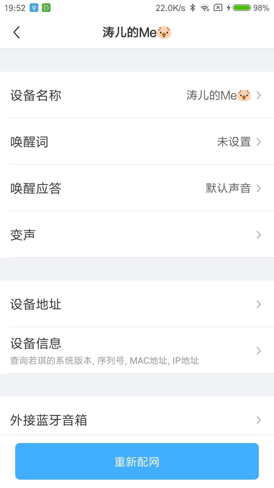
单个设备设置项页面
</div>


