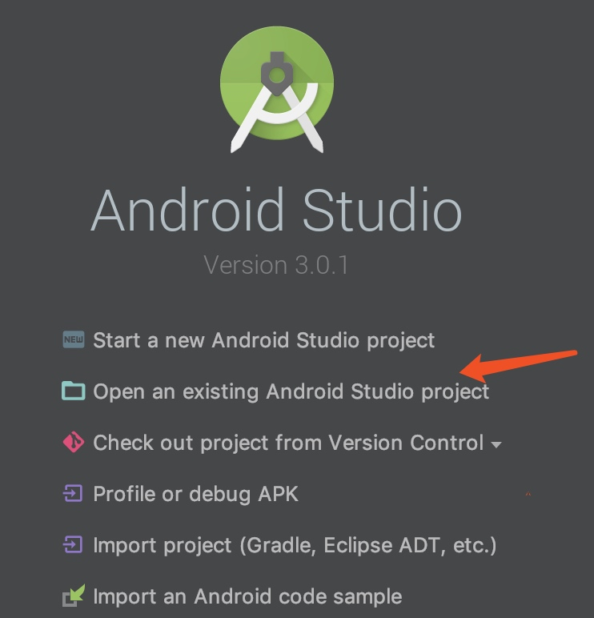

# 环境要求

1. 安装 Android Studio，配置好相应的开发环境，具体教程可以在网上搜索相关教程，这里不再赘述；
   **需注意的是，Android studio 的版本最好更新为 3.2.1；gradle 版本 4.6**。

2. 安装好 Android Studio 后，开始导入公版APP源码，具体操作如下：

点击箭头所指的选项，会弹出文件选择框，找到第一步下载的源码，点击确定后就可以自动导入源码到Android Studio中。

