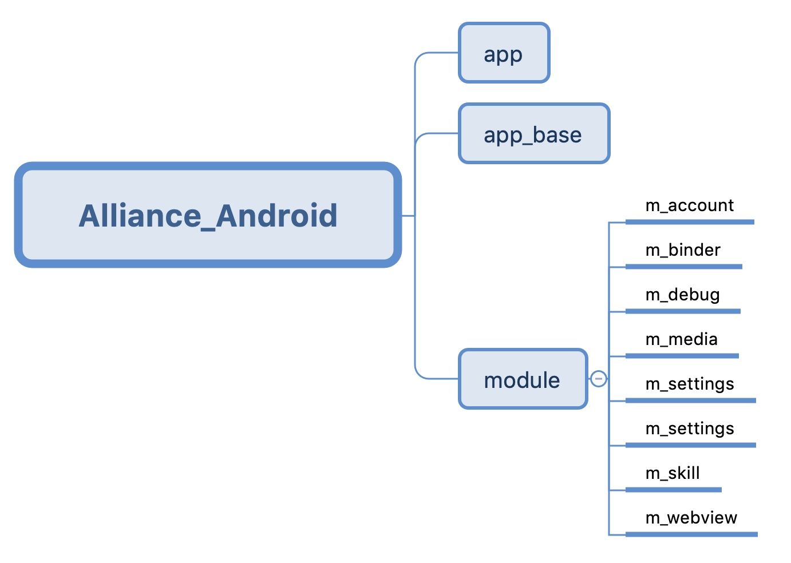

# 源码工程介绍

## 工程结构

公版 APP 安卓工程主要由 3 大部分构成，分别是：

* **app** ：APP 的主 module 模块，包含 APP 的初始化、启动和首页的相关业务逻辑；
* **app_base** ：APP 的基础库，包含工程中的一些通用的基类和工具类，还包含了公版 APP 需要厂商手动修改的配置文件；
* **module**：根据不同的业务逻辑，将整个 APP 的拆分成了 8 个不同的 module，每个 module 负责一块具体的业务逻辑，比如：m_account module 就主要是关于账户的相关功能。

具体工程结构如图所示：

Android studio 中对应的项目结构如下：

## module 功能介绍
工程中一共有 8 个 module，每个 module 负责一块具体的业务逻辑，具体如下：

* **m_account**：账户中心模块，主要包含了 APP 登录注册、密码找回和修改等关于账户的功能；
* **m_binder**：设备配网模块，主要包含了 APP 添加设备和重新配网等与配网相关的功能，比如：通过蓝牙去搜索设备，与设备建立连接，发送配网数据到设备等；
* **m_debug：APP** 调试模块，主要包含了 APP 当前开发环境的切换功能，APP 分为测试环境和正式环境，可根据需要进行环境的切换；
* **m_media**：畅听模块，主要包含了 APP 当前支持的全部多媒体内容，比如：音乐、故事和儿歌等，相关的媒体播放，控制，显示等操作都在该模块中实现；
* **m_settings**：设置模块，主要包含了 APP 中账户信息和设备信息的查看和修改；
* **m_skill**：发现模块，主要包含了 APP 中当前设备支持的全部技能信息；
* **m_webview：webview** 模块，APP 中很多地方需要加载 H5 页面，这是 APP 中对原生的webview 进行了相应封装以更加高效便捷的加载 H5 页面。

## APP 架构介绍
APP 采用的是 MVP 架构，每个模块中 **activity/fragment** 主要是负责 UI 层，即各个 Activity 和 Fragment的创建和数据显示，不包含具体的业务逻辑，只是 UI 相关。具体业务逻辑处理，比如数据的请求等操作，均放在 **presenter** 中，与 UI 的无关。如果界面中有列表控件，如 recycleview，则会在 **adapter** 处理与列表控件相关的 item 和数据等。如果页面中有一些自定义的控件，比如 popupWindow，则会将相关的控件放在 **view** 中。下图是 m_binder module 的目录结构：
 

