# 基础配置

1. 在项目中的 **RKConfiguration.swift** 中完成相关的自定义配置，各个字段说明如下， 把项目中对应的配置 **YOUR_CONFIGURATION** 替换成你申请的配置信息。其中 **kAppKey**，**kAppSecret**，**kAccessKey**，需要先在[开放平台](https://developer.rokid.com/#/) 注册一个帐号，并联系对接的项目经理申请。

    ```swift
    // MARK: - Rokid

    /// 设备的名称，填上厂商的名牌名称
    public let kBrandName = "若琪"
    /// 从若琪申请的AppKey
    let kAppKey = "YOUR_CONFIGURATION" // required
    /// 从若琪申请的AppSecret
    let kAppSecret = "YOUR_CONFIGURATION" // required
    /// 从若琪申请的AccessKey
    let kAccessKey = "YOUR_CONFIGURATION" // required

    // MARK: - Router

    /// 应用跳转的 router Scheme 名称，例如：rokidAlliance，rokid，genius.....，用于跳转原生页面，与http，https对应，它们是用于跳转webView
    let kRouterScheme = "rokidalliance" // required

    // MARK: - Help

    /// 设备使用帮助页面
    let kUseGuideUrl = "YOUR_CONFIGURATION" // optional
    
    // XMLY 喜马拉雅相关配置
    /// 喜马拉雅申请的APP name
    let kXMLYAppName: String = "YOUR_CONFIGURATION" // optional

    ```


2. 正确配置 **Bundle ID** 和 **Display Name** 。例如： **Bundle ID**：rokid.com.rokidalliance
**Display Name**: 若琪联盟

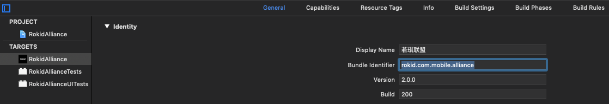

3. 配置**Keychain Sharing**，点击加号添加**Keychain Groups**, 一般和**Bundle ID**同名即可。 用于保存账户信息，如下图所示

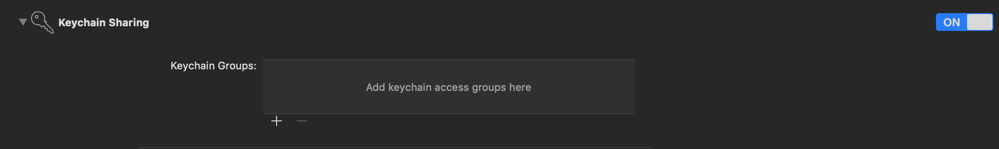

4. 其中 **kRouterScheme** 应用原生页面跳转的 **Scheme** ，需要在 **TARGETS/info/URL Types** 中添加一次。如图把 **rokid** 替换成 **kRouterScheme** 的值。其中还有些三方的 **URL Scheme** 的配置，比如喜马拉雅，微信，QQ。按照对应第三方的接入指南配置。以喜马拉雅为例：**xmly+"your appKey"**，以xmly开头，加上从喜马拉雅申请的 **appKey**。


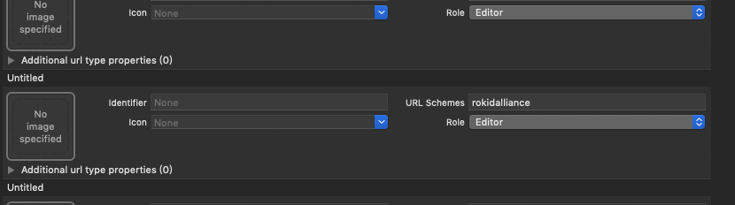

## 自定义APP颜色

1. 在 **Sources/UIKit** 目录中的 **RKStyles.swift** **Color** 结构体中来自定义APP的相关组件的颜色，其中包括如下表格所示。

| color name | color 色值 | 说明 |
| --- | --- | --- |
|  themeColor | #408CFF | 主题色，输入框光标颜色，可点击文字颜色， TitleBar 右边按钮可点击状态时颜色，对话流 asr 卡片背景 ，底部可点击蓝色按钮背景色|
|  darkPrimaryText | #323233 | 黑色字体，主标题，输入框文字颜色，输入框有焦点下划线颜色，TitleBar 左边按钮，TitleBar 标题文字颜色，验证码输入框颜色 |
|  grayLine | #DFE1E4 | 下划线默认颜色，输入框失去焦点下划线颜色、view 不可点击背景色，首页时间 card 背景色，切换设备背景色 |
|  grayPrimaryText | #9A9A9A | 灰色字体，副标题，输入框上的标题，输入框右边清除按钮颜色，输入框右边密码不可见按钮颜色 TitleBar 右边按钮不可点击颜色，切换设备——设备离线 icon 和文字颜色，列表item右边可点击icon |
|  commGrayBackground | #F7F7F7 | 输入框背景颜色，viewController 灰色背景色，dialog 灰色背景色，首页对话流 card 背景色 |
|  navigationBackItem | #555556 | 顶部导航栏图标颜色（搜索 icon，播放器 icon） |
|  commomeRedText | #F90210 | 电池电量低于20%背景色，设备card离线 “重新配网” 背景色和文字颜色 |
|  offlineBackground | #FFF6F4 | 首页，畅听页，发现页底部设备离线背景色 |


## 设备配网

通过若琪公版 **App** 为设备配置网络，主要涉及到两个配置 **Json** 文件的修改，1. 设备列表； 2. 设备详情； 整个流程需要做的配置如下：

1. 配网首页设配列表的信息配置。在 **Resources/Default/bind_home.json** 文件中可以设置配网首页，如图所示。

 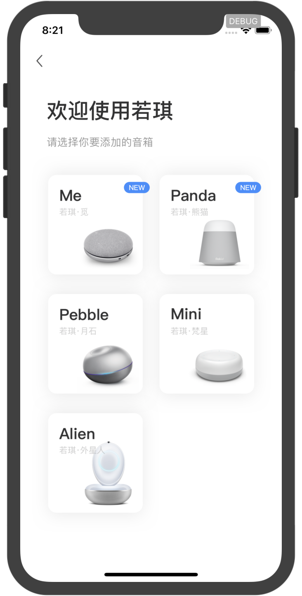

```json
[
  {
  "binderType": "ble_bind", // 配网类型，支持："ble_bind", "ble_rebind"
  "isNew": true, // 是否为新品，新品的话，对应设备图片上会一个NEW的角标
  "linkUrl": "rokid://binder/bootGuide?type=Me", // 页面跳转的URL，其中的 rokid scheme 需要与基础配置中的 let kRouterScheme = "YOUR_CONFIGURATION" 的值保持一致。type 是设备的名称

  "blePrefix": "Rokid-Me-",	// 设备蓝牙的名称前缀，用于搜索蓝牙设备的时候，只显示有改前缀的蓝牙设备
  "imageUrl": "http://rokid.oss-cn-qingdao.aliyuncs.com/mobile-app/binder/img/home/me.png", // 设备预览图
  "deviceTypeName": "Me" // 设备名称
  },
  .
  .
  .
  .
 ]

```

相关字段具体说明如表格所示：

| key | 类型 | 说明 |
| --- | --- | --- |
| binderType | String | 配网类型，值：**ble_bind**——配网，**bel_rebind**——重新配网|
| isNew | boolean | 是否为新设备类型，true则表示为新设备，配网首页设备图片右上角则会增加一个icon |
| linkUrl | String | 点击配网首页某个设备后的跳转uri，需注意的是，uri 后面请拼上当前点击的设备类型，具体格式如：rokid://binder/bootGuide?type=Me|
| blePrefix | String | 该设备类型的蓝牙前缀，具体格式如: Rokid-Me-|
| imageUrl | String | 当前设备预览图片的 url|
| deviceTypeName | String | 当前设备的名称|
不同厂商可根据当前拥有的设备个数，对如上的 json 数组进行增加或者删除，只要保证格式一致即可。


2. 具体某个设备类型配网数据信息的配置，在 **Resources/Default/bind_Pebble.json** 文件中可以设置具体某个设备的配网信息。

 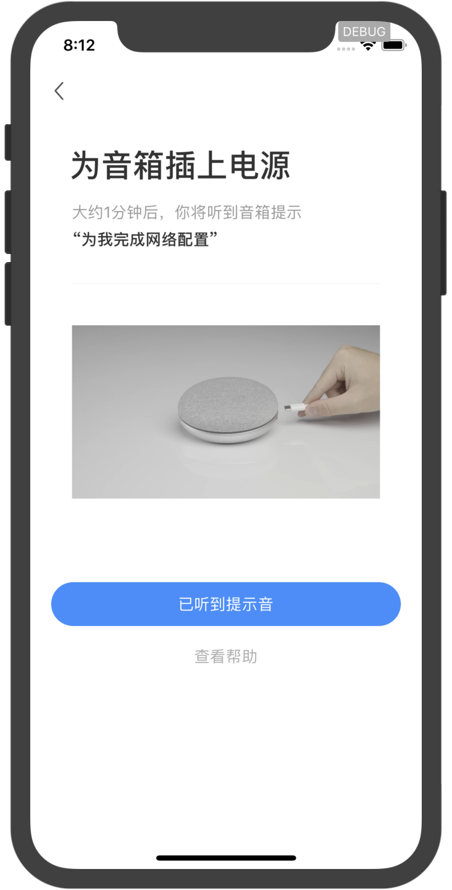

```json
{
    "type": "ble_bind", // 配网类型，支持："ble_bind", "ble_rebind"
    "deviceTypeName": "Pebble", // 设备名称
    "isNew": false, // 是否为新品
    "linkUrl": "rokid://binder/bootGuide?type=Pebble", // 页面跳转的URL
    "blePrefix": "Rokid-Pebble-", // 设备蓝牙的名称前缀
    "imageUrl": "http://rokid.oss-cn-qingdao.aliyuncs.com/mobile-app/binder/img/home/pebble.png", // 设备预览图
    "support": {
        "is5GEnable": true, // 是否支持5g
        "tip": "",			// 哪些WiFi不支持的说明
        "helpButton": "",   // 帮助按钮的文字
        "connectButton": "发送到音箱" // 发送WiFi账号密码的按钮文案
    },
    "guide": { // 设备详情的指南页面的数据
        "title": "长按音箱顶部「O」键",  // 标题
        "subtitle": "大约1分钟后，你将听到音箱提示", // 副标题
        "description": "“为我完成网络配置”", // 描述信息
        "videoUrl": "https://s.rokidcdn.com/mobile-app/video/binder/pebble.mp4", // 配网操作的介绍视频，没有的话，会先显示下面的首帧图片
        "coverImageUrl": "https://s.rokidcdn.com/mobile-app/video/binder/pebble_first.png", // 介绍视频的首帧图片
        "usageHelper": { // 使用帮助相关信息
            "button": "查看帮助",
            "title": "没有听到配网提示音？",
            "subtitle": "帮助若琪检查以下内容",
            "image": "http://rokid.oss-cn-qingdao.aliyuncs.com/mobile-app/binder/img/guide/pebble.png",
            "tips": [
                     {
                     "title": "确认音箱已开机",
                     "text": "尝试点击顶部电源键「O」\n若有蓝色灯光亮起，则表示音箱已开机。\n若蓝色灯光没有亮起，请先开机：插上电源，长按电源键「O」，直到亮起蓝灯。"
                     },
                     {
                     "title": "双击音箱顶部「O」键",
                     "text": "音箱将提示：“为我完成网络配置”，并闪烁橙色灯光。"
                     }
                     ]
        },
        "noDeviceHelper": { // 没有找到设备的帮助相关信息
            "button": "已听到提示音",
            "title": "未找到可连接的音箱",
            "subtitle": "帮助若琪检查以下内容",
            "image": "http://rokid.oss-cn-qingdao.aliyuncs.com/mobile-app/binder/img/guide/pebble.png",
            "tips": [
                     {
                     "title": "确认音箱已开机",
                     "text": "尝试点击顶部电源键「O」\n若有蓝色灯光亮起，则表示音箱已开机。\n若蓝色灯光没有亮起，请先开机：插上电源，长按电源键「O」，直到亮起蓝灯。"
                     },
                     {
                     "title": "双击音箱顶部「O」键",
                     "text": "音箱将提示：“为我完成网络配置”，并闪烁橙色灯光。"
                     }
                     ]
        }
    },
    "progresses": [ // 配网的进度状态码以及进度控制
                   {
                   "doingCode": "10", // 正在进行的code
                   "doneCode": "11", // 完成的code
                   "doingText": "正在连接WiFi", // 正在进行的文案提示
                   "doneText": "音箱已成功联网" // 完成的文案提示
                   },
                   {
                   "doingCode": "100",
                   "doneCode": "101",
                   "doingText": "正在进行身份验证",
                   "doneText": "完成身份验证"
                   },
                   {
                   "doingCode": "200",
                   "doneCode": "201",
                   "doingText": "正在将设备绑定到你的账号",
                   "doneText": "设备和账号绑定成功"
                   }
                   ],
    "errors": [	// 配网的错误状态码以及进度控制
               {
               "code": "-11", // 错误码
               "subtitle": "Wi-Fi 密码不正确", // 配网错误页面副标题
               "tips": [
                        "请检查 Wi-Fi 或热点账号密码是否正确" // 出错是设备的提示信息
                        ]
               },
               {
               "code": "-12",
               "subtitle": "Wi-Fi 连接异常",
               "tips": [
                        "请检查 Wi-Fi 或热点账号密码是否正确"
                        ]
               },
               {
               "code": "-13",
               "subtitle": "没有找到该网络，请检查后重试",
               "tips": [
                        "请检查 Wi-Fi 或热点账号密码是否正确"
                        ]
               },
               {
               "code": "-14",
               "subtitle": "密码长度不正确",
               "tips": [
                        "请检查 Wi-Fi 或热点账号密码是否正确"
                        ]
               },
               {
               "code": "-99",
               "subtitle": "Wi-Fi 连接异常",
               "tips": [
                        "尝试将音箱放在离路由器更近的地方",
                        "请检查 Wi-Fi 或热点账号密码是否正确",
                        "保持手机网络正常"
                        ]
               },
               {
               "code": "-101",
               "subtitle": "Wi-Fi 连接异常",
               "tips": [
                        "尝试将音箱放在离路由器更近的地方",
                        "请检查 Wi-Fi 或热点账号密码是否正确",
                        "保持手机网络正常"
                        ]
               },
               {
               "code": "-201",
               "subtitle": "其他，或我也不确定",
               "tips": [
                        "尝试将音箱放在离路由器更近的地方",
                        "请检查 Wi-Fi 或热点账号密码是否正确",
                        "保持手机网络正常"
                        ]
               },
               {
               "code": "-1000",
               "subtitle": "Wi-Fi 连接异常",
               "tips": [
                        "尝试将音箱放在离路由器更近的地方",
                        "请检查 Wi-Fi 或热点是否正常"
                        ]
               },
               {
               "code": "-1001",
               "subtitle": "手机网络连接异常",
               "tips": [
                        "请检查手机网络状态"
                        ]
               }
               ]
}

```

1. 其中 **support** 字段的说明，该数据主要用于 **App** 中的发送 **WiFi** 信息界面，对应的是 **RKBindPasswordViewController**。

 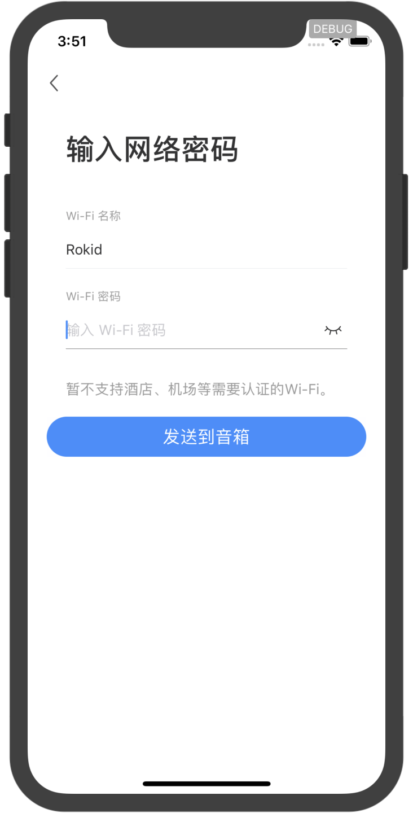

| key | 类型 | 说明 |
| --- | --- | --- |
| is5GEnable | boolean | 该设备类型是否支持 5G 网络|
| tip | String | 不支持 5G 网络的提示文案|
| helpButton | String | 帮助按钮的文案 |
| connectButton | String | 发送WiFi账号密码的按钮文案 |

2. **guide** 相关字段说明：该数据主要用于 APP 中的单个设备搜索蓝牙和对应的两个帮助界面，对应的是 **RKBindNoDeviceViewController**、**RKBindNoSoundViewController**

 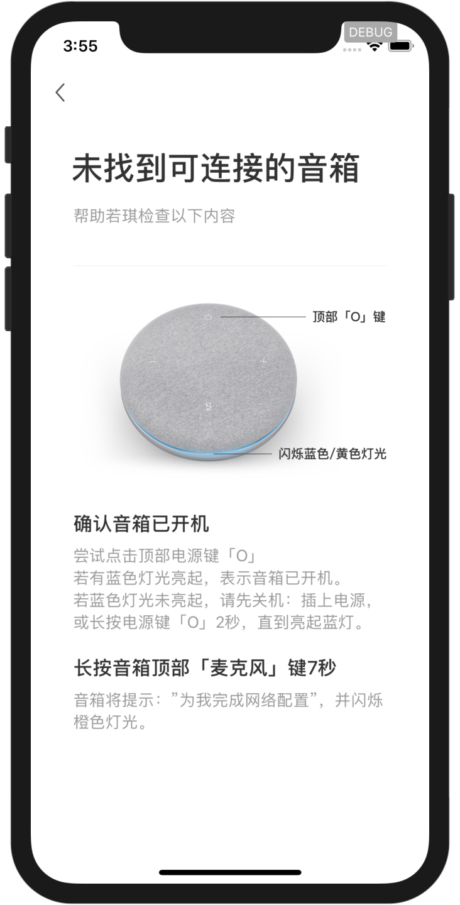

 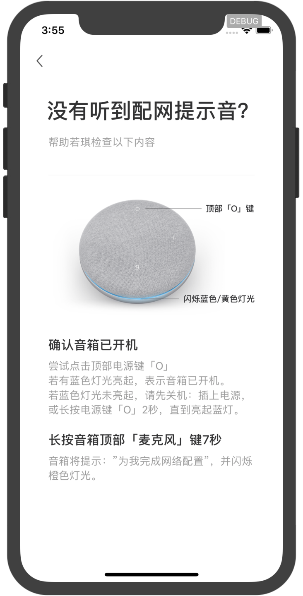

| key | 类型 | 说明 |
| --- | --- | --- |
| title | String | 页面标题 |
| subtitle | String | 页面子标题 |
| description | String | 页面描述信息 |
| videoUrl | String | 页面视频 URL |
| coverImageUrl | String | 页面视频第一帧图片 URL|
| usageHelper | Object | 没有听到配网提示音的帮助页面数据信息，对应 **RKBindNoSoundViewController**|
| noDeviceHelper | Object | 没有找到可连接的音箱帮助页面数据信息，对应 **RKBindNoDeviceViewController**|

3. **progresses** 相关字段说明：
该数据主要用于 APP 中配网过程中相关页面的信息展示，对应的是 **RKBindProcessViewController**。

| key | 类型 | 说明 |
| --- | --- | --- |
| doingCode | String | 当前步骤准备进行的 code|
| doneCode | String | 当前步骤完成时的 code|
| doingText | String | 当前步骤准备进行时的文案 |
| doneText | String | 当前步骤完成时的文案 |

| 状态值 | 说明 |
| --- | --- | --- |
| 10 | wifi连接中 |
| 11 | wifi连接成功 |
| -11 | wifi密码错误 |
| -12 | wifi连接超时 |
| -13 | 没找到当前wifi |
| -14 | wifi密码长度不正确 |
| -98 | 运营商网络错误 |
| 100 | 登录中 |
| 101 | 登录成功 |
| -101 | 登录失败 |
| 200 | 绑定中 |
| 201 | 绑定成功 |
| -201 | 绑定失败 |

4. **errors** 相关字段说明：
该数据主要用于 APP 中配网过程中发生异常时的信息展示，对应的是 **RKBindErrorViewController**

| key | 类型 | 说明 |
| --- | --- | --- |
| code | String | 配网失败的错误码|
| subtitle | String | 配网错误页面副标题|
| tips | Object | 配网错误页面相关的提示信息数据 |

**注意：** 该配置文件命名的通用格式为： **bind_"deviceType".json**，厂商在设置自己的设备时，只需修改具体的设备类型即可，例如你有个设备类型叫做 “ABC”，那么对应的文件名称为 **bind_ABC.json**，“**bind_**”保持不变。同时，一个配置文件对应一个设备类型，若有多个设备类型，则添加对应数量的配置文件即可。

配置设备设置项信息
不同的设备可能会有不同的设置项，为了方便厂商适配各自的设备，公版 APP 也提供了一些配置文件来设置各个设备的具体设置项信息。

5. “我的”页面设置项列表数据配置
公版 APP 在“我的”页面默认设置了 6 项主要且通用的设置信息，如需修改，请到 ****Resources/Default/defaultSettingHome.json**** 文件，该数据对应的类是**SettingsIndexFragment**， 具体的格式如下：

```json
[
  {
    "settingIndexConfigList": [
      {
        "id": 1,
        "groupId": "1000",
        "name": "设备管理",
        "type": "deivceManage",
        "iconUrl": "https://s.rokidcdn.com/app/setting_index/settings_device_manage.png",
        "linkUrl": "rokid://settings/device_list",
        "enabled": true,
        "version": "1.0.0"
      },
      {
        "id": 2,
        "groupId": "1000",
        "name": "设备升级",
        "type": "deviceUpdateAll",
        "iconUrl": "https://s.rokidcdn.com/app/setting_index/settings_update.png",
        "linkUrl": "rokid://settings/device_update_all",
        "enabled": true,
        "version": "1.0.0"
      },
      {
        "id": 3,
        "groupId": "1000",
        "name": "房间管理",
        "type": "roomManage",
        "iconUrl": "https://s.rokidcdn.com/app/setting_index/settings_room_manage.png",
        "linkUrl": "https://s.rokidcdn.com/homebase/rokid$env$/index.html#homes/defaultHomeId/rooms",
        "enabled": true,
        "version": "1.0.0"
      },
      {
        "id": 4,
        "groupId": "1000",
        "name": "智能家居",
        "type": "sceneIndex",
        "iconUrl": "https://s.rokidcdn.com/app/setting_index/settings_mine_scene.png",
        "linkUrl": "https://s.rokidcdn.com/homebase/tob/index.html#/homes/index",
        "enabled": true,
        "version": "1.0.0"
      }
    ],
    "title": "",
    "groupId": "1000"
  },
  {
    "settingIndexConfigList": [
      {
        "id": 12,
        "groupId": "1002",
        "name": "使用帮助",
        "type": "useHelp",
        "iconUrl": "https://s.rokidcdn.com/app/setting_index/settings_help.png",
        "linkUrl": "rokid://help/index",
        "enabled": true,
        "version": "1.0.0"
      },
      {
        "id": 13,
        "groupId": "1002",
        "name": "联系我们",
        "type": "connectUs",
        "iconUrl": "https://s.rokidcdn.com/app/setting_index/settings_connect_us.png",
        "linkUrl": "rokid://settings/connectUs",
        "enabled": true,
        "version": "1.0.0"
      }
    ],
    "title": "",
    "groupId": "1002"
  }
]
```

设置项数据是按照组的形式来进行划分，具体的字段说明，如表格所示：

| key | 类型 | 说明 |
| --- | --- | --- |
| title | String | 每组设置项的标题 |
| groupId | String | 每组设置项的 Id|
| settingIndexConfigList | Object | 每组具体的设置项数据信息|

**settingIndexConfigList** 的具体格式如下：

| key | 类型 | 说明 |
| --- | --- | --- |
| id | String | 设置项 Id |
| groupId | String | 设置项所属的组的 Id|
| name | String | 设置项名称|
| type | String | 设置项类型|
| iconUrl | String | 设置项icon URL|
| linkUrl | String | 设置项点击后的跳转 URL|
| enabled | Boolean | 默认为 true，扩展字段|
| version | String | 默认为 1.0.0，扩展字段|


 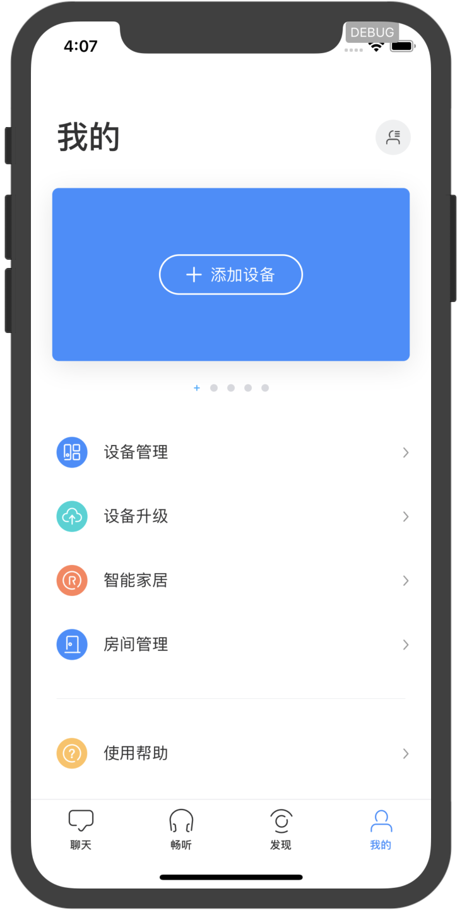


6. 具体某个设备类型设置项数据配置
不同的设备可能具有不同的设置项，为了方便厂商配置设备的具体设置项信息，公版 APP 也是通过配置文件来进行相关的设置，这部分数据主要是设备的卡片数据（对应配置文件中的 **quickSettingList** 字段）和该设备类型支持的全部设置项（对应配置文件中的 **settingList** 字段），配置这块数据需到 ****Resources/Default/defaultDeviceTypes.json**** 文件，文件具体格式如下：

```json
[
  {
    "typeId": "rokid",
    "typeName": "Rokid",
    "cnName": "未知外星设备",
    "blePrefix": "Rokid",
    "imageUrl": "https://s.rokidcdn.com/mobile-app/icon/device/rokid.png",
    "quickSettingList": [
      {
        "type": "vtWord",
        "name": "唤醒词",
        "iconUrl": "https://s.rokidcdn.com/mobile-app/setting_device/settings_vt_word.png",
        "linkUrl": "rokid://settings/device/vtWord",
        "action": "UPDATE",
        "minVersion": "0.0.0",
        "maxVersion": "9.9.9",
        "feature": false,
        "needOnline": true
      },
      .
      .
      .
    ],
    "settingList": [
      [
        {
          "type": "deviceNick",
          "name": "设备名称",
          "linkUrl": "rokid://settings/device/nickName",
          "action": "UPDATE",
          "minVersion": "0.0.0",
          "maxVersion": "9.9.9",
          "feature": false,
          "needOnline": false
        },
        {
          "type": "vtWord",
          "name": "唤醒词",
          "iconUrl": "https://s.rokidcdn.com/mobile-app/setting_device/settings_vt_word.png",
          "linkUrl": "rokid://settings/device/vtWord",
          "action": "UPDATE",
          "minVersion": "0.0.0",
          "maxVersion": "9.9.9",
          "feature": false,
          "needOnline": true
        }
      ],
      [
        {
          "type": "deviceLocation",
          "name": "设备地址",
          "linkUrl": "rokid://settings/device/location",
          "action": "LINK",
          "minVersion": "0.0.0",
          "maxVersion": "9.9.9",
          "feature": false,
          "needOnline": false
        },
        {
          "type": "deviceInfo",
          "name": "设备信息",
          "description": "查询若琪的系统版本, 序列号, MAC地址, IP地址",
          "iconUrl": "https://s.rokidcdn.com/mobile-app/setting_device/settings_device.png",
          "linkUrl": "rokid://settings/device/about",
          "action": "LINK",
          "minVersion": "0.0.0",
          "maxVersion": "9.9.9",
          "feature": false,
          "needOnline": false
        }
      ]
    ]
  },
  {
    "typeId": "102463A173734BAAB3E6EB5F497DB9FE",
    "typeName": "Pebble",
    "cnName": "若琪 · 月石",
    "blePrefix": "Rokid-Pebble",
    "imageUrl": "https://s.rokidcdn.com/mobile-app/icon/device/pebble.png",
    "quickSettingList": [
    ],
    "settingList": [
    ]
  }
]
```
具体的字段说明，如表格所示：

| key | 类型 | 说明 |
| --- | --- | --- |
| typeId | String | 设备类型 Id |
| typeName | String | 设备类型名称|
| cnName | String | 设备中文名称|
| blePrefix | String | 该设备蓝牙搜索前缀 |
| imageUrl | String | 设备预览图片 URL|
| quickSettingList | Object | 设备卡片4个快捷设置项入口信息数据|
| settingList | Object | 设备全部设置项信息数据 |

**quickSettingList** 和 **settingList** 的具体格式如下：

| key | 类型 | 说明 |
| --- | --- | --- |
| type | String | 设置项类型 |
| name | String | 设置项名称|
| iconUrl | String | 设置项icon URL|
| linkUrl | String | 点击设置项后跳转的 URL|
| action | String | 设置项点击后的操作，类型有 5 类：**default**——默认，**DIALOG**——点击后弹出对话框，**UPDATE**——点击修改属性值返回需要更新，**SWITCH**——有 switch 按钮，**LINK**——点击后跳转到其他页面|
| minVersion | String | 设置项支持的最低系统版本|
| maxVersion | String | 设置项支持的最高系统版本|
| feature | Boolean | 设置项是否显示小红点，一般用于突出系统提供的新功能设置项|
| needOnline | Boolean | 设置项在 UI 上是否显示下划线，列表中最后一个设置项 item 置为 true|

下面两张图片分别对应卡片设置项 **quickSettingList** 和 全部设置项 **settingList** 的图片

 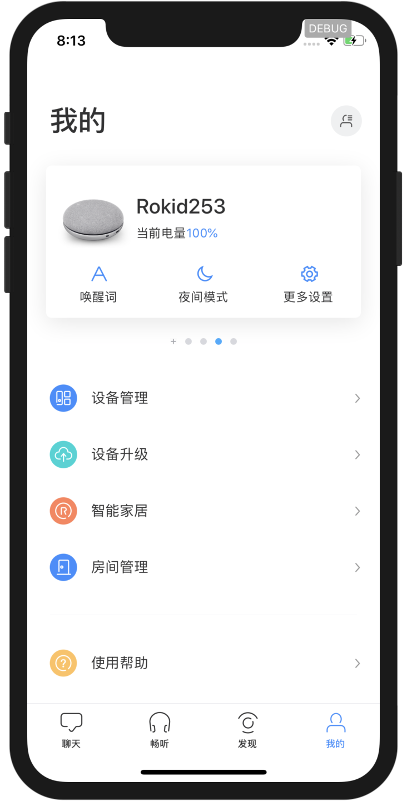

 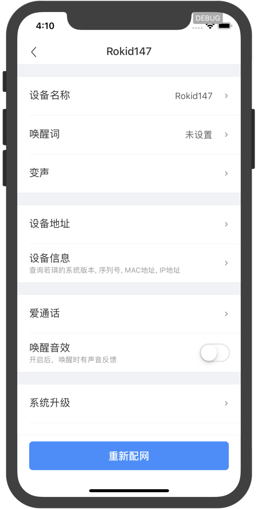


