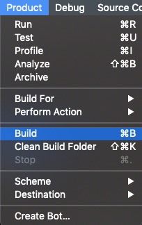

# 运行环境

1. Device System: **iOS 8.0 or later**
2. language Version: **Swift 4.0** 
3. IDE Version: **Xcode 10 or later**

# 编译和运行项目

1. 项目是用 **CocoaPods** 管理第三方依赖的，**CocoaPods** 的环境搭建参考[官方文档](https://guides.cocoapods.org/using/getting-started.html) 或者这篇[博文](https://blog.devtang.com/2014/05/25/use-cocoapod-to-manage-ios-lib-dependency/)
2. 项目下载成功之后，在命令行工具中（ **Mac** 上的终端程序或者 **iTerm**）切换到项目目录中，然后执行 **pod install** 命令，即安装 **Podfile** 文件中的第三方依赖库
3. 成功之后双击 **RokidAlliance.xcworkspace** 该文件，用 **Xcode** 打开
4. 编译项目如下图所示进行操作。

成功后重新编译，成功后，配置 **App** 的一些基础信息，才能正确运行。

