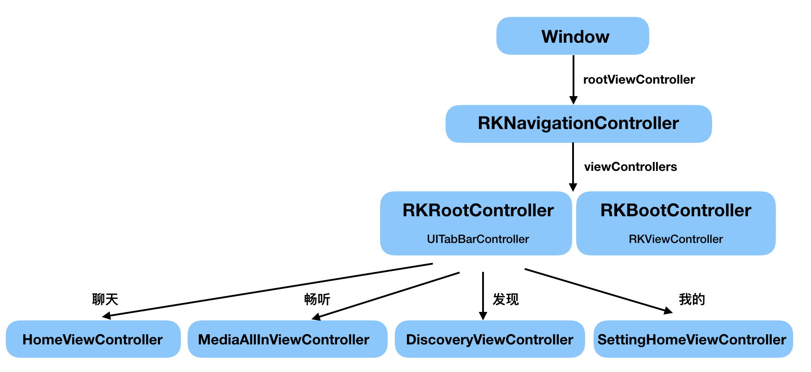
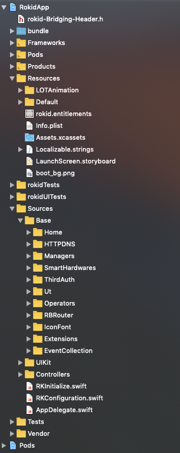

# 页面和项目结构

1. APP页面结构的如下图

2. 项目结构如下。

主要目录：
1. **Resources**： 存放项目中的一些资源文件，包括图片资源、默认的配置json文件、动画json文件
2. **Sources**： 存放项目的源码
	1. **Base**：一些基础的功能模块
        1. **HTTPDNS**：封装的阿里云 **DNS** 功能
        2. **RBRouter**：封装 **URL** 跳转原生页面，**H5** 页面的功能
        3. **Operators**：自定义运算符，用 **json** 转 **model**
        4. **EventCollection**；封装的埋点统计功能，暂时没有具体实现，后续优化
        5. **ThirdAuth**：封装的第三方授权工具类，包括 **QQ**，**微信**
        6. **Home**：封装的获取 **QQ** 音乐绑定的 **RKHomeManager**
	2. **UIKit**：封装的一些UI控件
        1. 主要包括全局配置 **App** 颜色的 **RKStyle**； **banner** 滚动视图： **RKBannerView**；**loading** 视图： **RKLoadingView**；大的标题视图：**RKLargeNavigationBar**；
	3. **Controllers**： 项目中的所有控制器
        1. **Root**：根控制器，**RKRootViewController**, **UIWindow** 的 **rootViewController**。**RKBootViewController**，启动时加载的 **viewController**，用于控制页面跳转。
        2. **Home**：聊天模块，对应的主控制器是 **RKHomeViewController**
        3. **MediaV3**：畅听模块，对应的主控制器是 **RKMediaAllInViewController**，
        4. **Discovery**：  发现模块，对应的主控制器是 **RKDiscoveryViewController**
        5. **Settings**： 我的模块，对应的主控制器是 **RKSettingHomeViewController**
        6. **Account**： 账号模块，包括登录：**RKLoginViewController** ，注册：**RKRegisterViewController**，验证码：**RKVerfiySMSCodeViewController**，重置密码：**RKResetPasswordViewController**，创建密码：**RKCreatePasswordViewController**，忘记密码：***RKForgetPasswordViewController**
        7. **Binder**：设备配网模块，包括配网首页：**RKBindHomeViewController**，输入 **WiFi** 账号密码发送给设备的页面：**RKBindPasswordViewController**；配网的进度页面：**RKBindProcessViewController**
        8. **MultiMedia**：多媒体模块，包括播放器页面：**RKPlayerViewController**
        9. **Debug**：**Debug** 模块，用与 **Debug** 模式下，调试 **App**，包括配网时的蓝牙日志：**RKDebugBluetoothViewController**，聊天模块的消息日志：**RKDebugPackageViewController**
	4. **RKInitialize.swift**：做一些初始化的工作，
	5. **RKConfiguration.swift**：一些配置文件，包含三方的 **AppKey**、**AppId**、跳转路由的 **scheme**、设备的名称
	6. **AppDelegate.swift**： 全局的 **AppDelegate**

3. **Vendor**: 存放第三方的一些 **framework**

