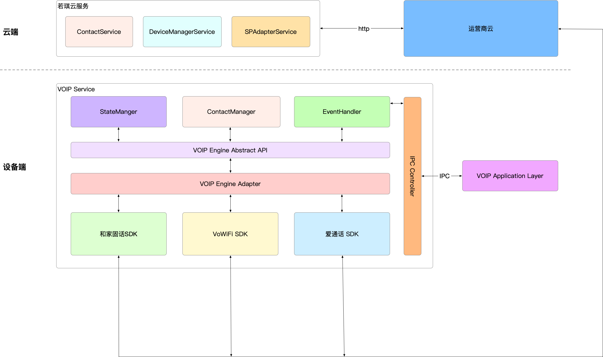
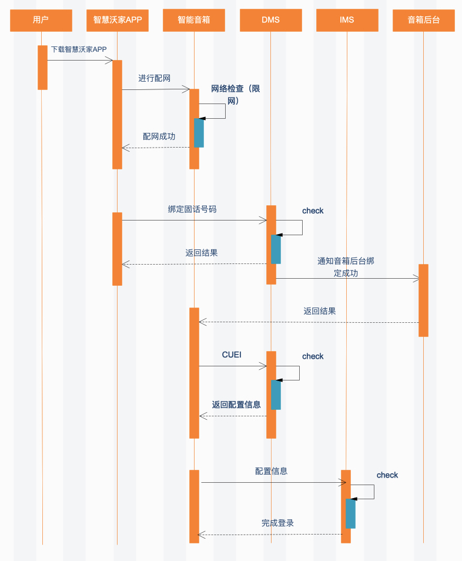
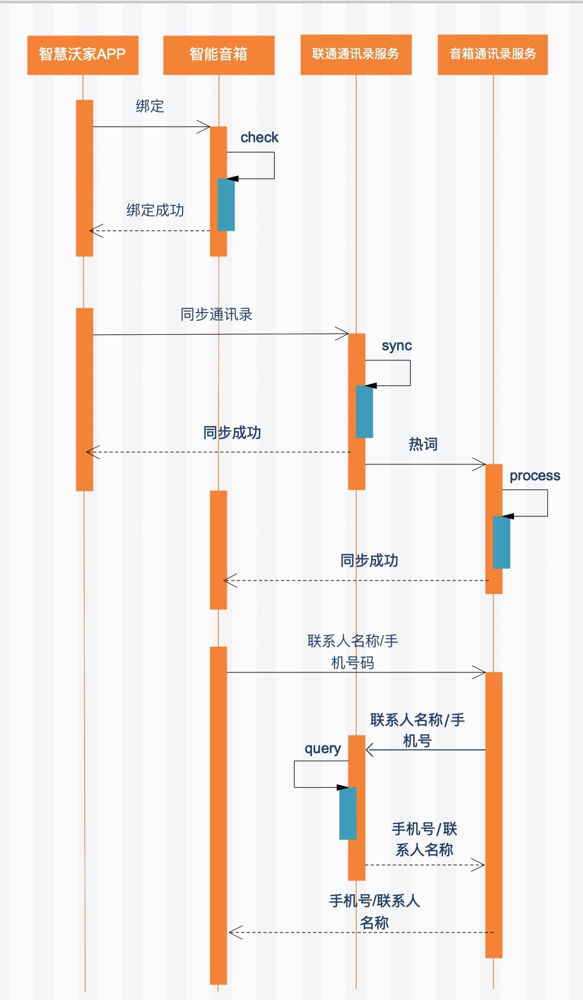

# 中国联通 VoWIFI接入文档（Yodaos）
## 方案介绍
* 本方案的目的是为了让厂家快速集成联通VoWiFi功能，实现使用联通固网号码拨打和接听电话的功能

##功能描述
* 固话号码绑定：用户在智慧沃家APP上选择绑定固话号码，验证通过后，音箱激活通话功能
* 固话号码解绑：用户在智慧沃家APP上选择解绑固话号码，解绑后将不能再使用通话功能
* 通讯录同步：用户使用智慧沃家APP同步和管理通讯录，后续可以直接用音箱通过使用联系人名字的方式进行拨打，同时音箱对于呼入的来电也能够直接报出来电号码所对应的联系人的姓名。

## 整体架构图

## 整体时序图

## 通讯录同步时序图

## 代码移植流程
####拉取运营商（联通）相关代码
* 我们的方案代码是基于k18芯片的，硬件平台是若琪的开发板DEV3.31
* 默认使用的代码配置文件名：unicom-yodaos-v7.33.x.xml
* 其中于联通相关的代码仓库如下
	* 客户端部分（js实现）
`<project name="kamino_rokidos/applications/voip-cmcc" path="applications/voip-cli" revision="v1.1.0" />`
	* 服务端抽象层（c/c++）
`<project name="Project kamino_rokidos/open-platform/embedded-linux/voip-service" path="applications/voip-service" revision="master"/>`
	* 服务端联通部分实现（c/c++）
`<project name="Project kamino_rokidos/open-platform/embedded-linux/voip-service-unicom" path="applications/unicom" revision="master"/>`

* 我们的客户端部分以及服务端抽象层可以做到通用化，厂商可以尝试自己实现服务端的impl部分，用于适配移动，电信等其他运营商的voip功能

## 产品编译配置
* 我们默认使用的配置位于products/rokid/dev3.3
* 代码下载完毕后执行./build.sh -p leo_k18_dev33 -j32 -c
* 如果厂商需要移植到自己的工程下面，需要参照products/rokid/dev3.3配置自己的工程

## 配置文件说明
### products/rokid/dev3.3/CMakeLists.txt
* 主要目的是将运营商模块添加进编译系统，同时使一些个性化配置生效

### products/rokid/dev3.3/configs
* 该目录主要是一些编译配置选项

### products/rokid/dev3.3etc/yoda/wormhole.json
* 定义了一些特有的mqtt消息

### products/rokid/dev3.3etc/res
* 主要用于存放灯效以及音频文件，厂商可以自行替换

### products/rokid/dev3.3etc/workdir_asr_cn
* 前端的一些配置

