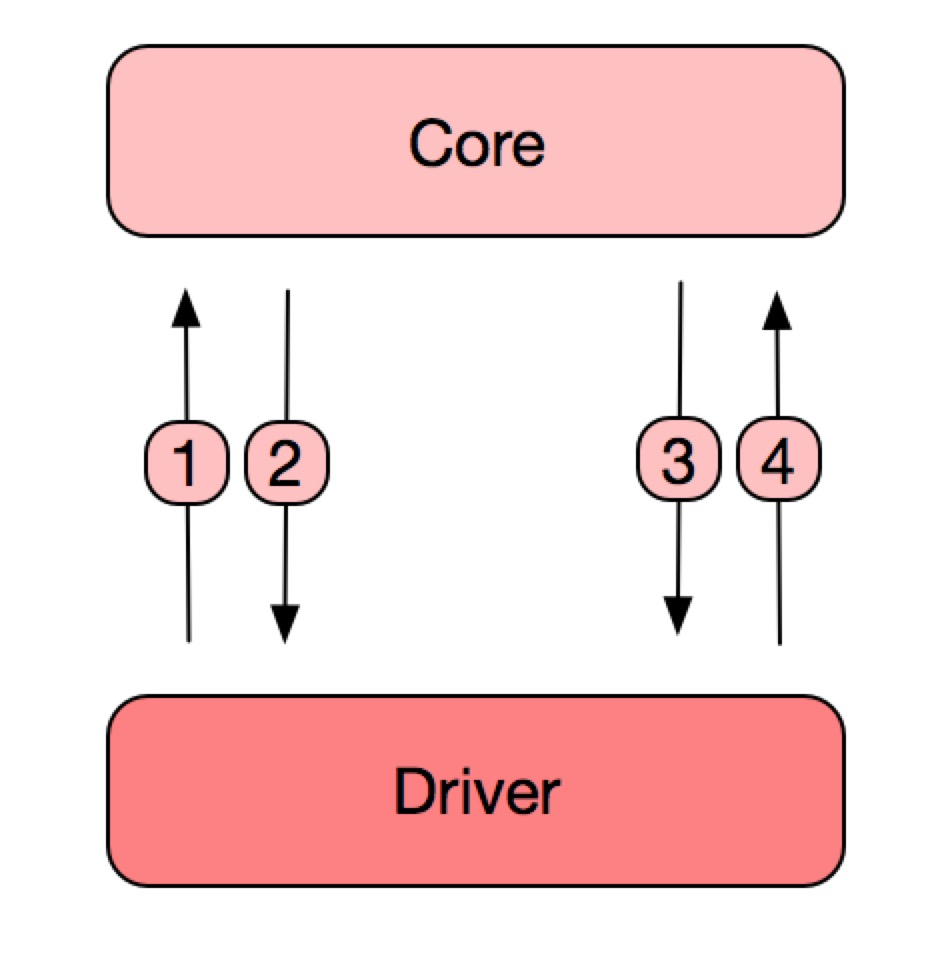

# Android Native Driver

Native Driver 主要是针对 **使用 Android SDK 的第三方厂商** 方式来对接,  我们推荐使用 http 远程驱动 + OAuth 授权的方式对接，如果上述组合无法满足需求， 可以联系我们申请基于 Android Native Driver 开发SDK，邮箱 [Smart Home Connect](mailto:smarthomeconnect@rokid.com)。

Native Driver 驱动在内部通过实现 [HTTP Driver](./http-remote-driver.md) 实现 获取/控制 设备。

本文档主要用针对第三方开发者开发可运行在Rokid设备上提供智能家居服务。

智能家居 通讯 交互图

	

1. Driver 通过 Url 请求 Core 获取端口号。
2. Core   返回端口号给 Driver, 后续通过该端口通讯。
3. Core   发送 登录授权/获取设备/控制请求。
4. Driver 返回 登录结果/设备列表/控制结果。
