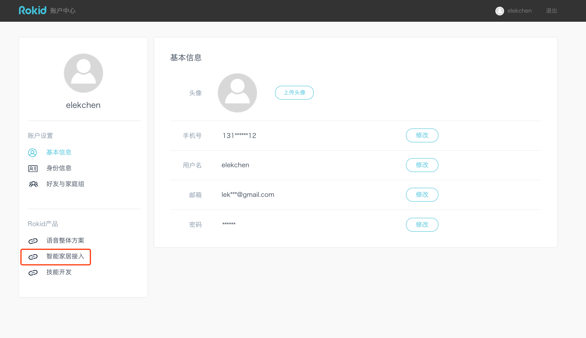
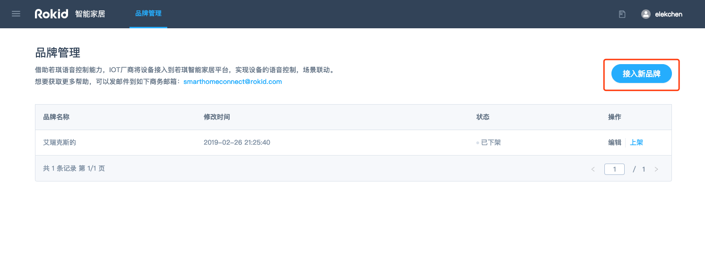
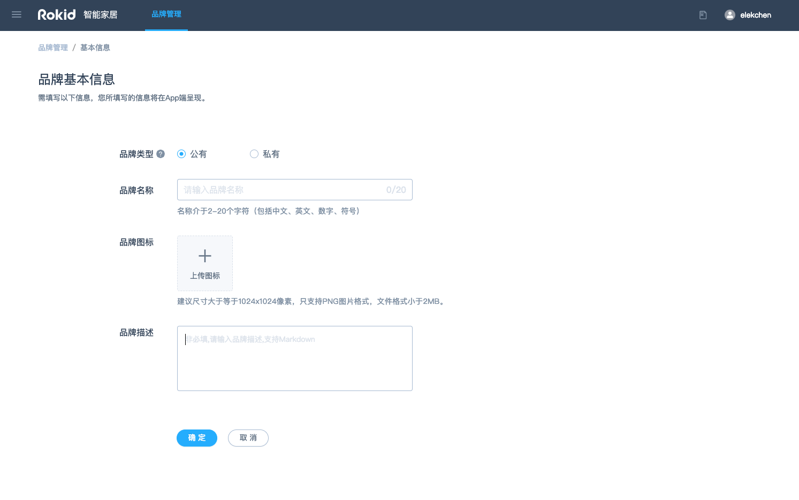
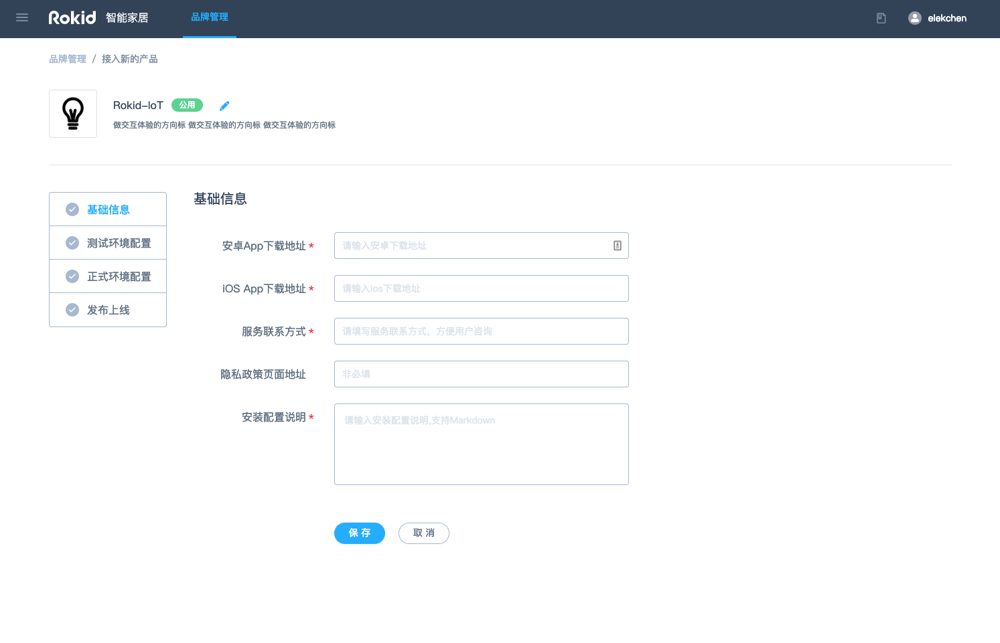
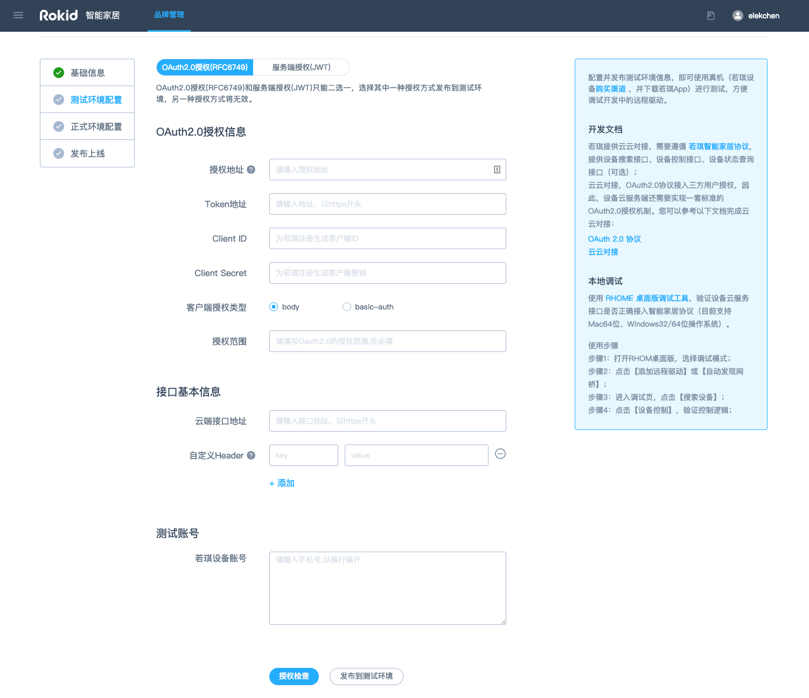
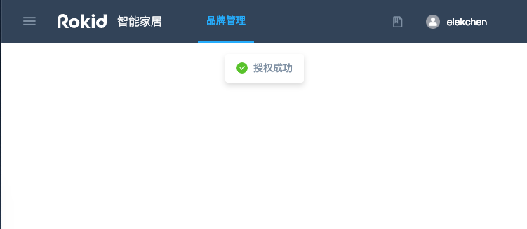
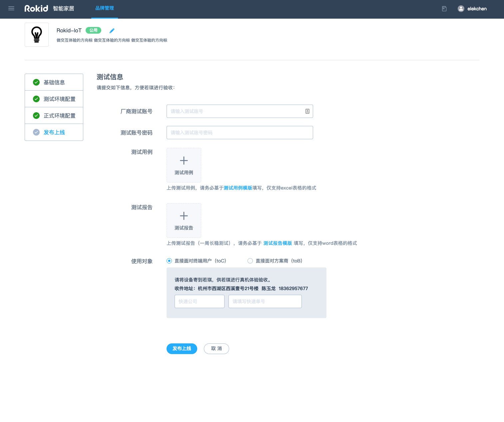
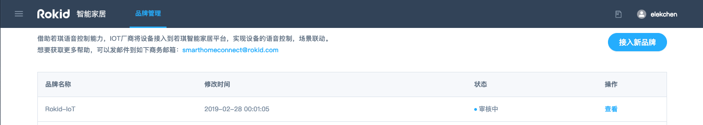

## 云云对接

云云对接，即厂商自建设备云服务与 Homebase 云服务的对接，厂商智能家居设备连接自建云服务后，适配若琪智能家居协议，实现与 Homebase 云服务的对接。

### 简介

### 对接步骤

1. 完成 [_企业认证_](https://account.rokid.com/#/setting/auth)
2. 点击左下角 **智能家居接入**
   
3. 点击 **接入新品牌**
   
4. 填写品牌基本信息

- 品牌类型

  - 公有：**可以作为智能家居对外输出方案对外输出**
  - 私有：**仅限于品牌创建者自有项目中的 C 端用户使用，不能通过若琪方案输出**

- 品牌名称
- 品牌图标（大小：1024\*1024px，只支持 png 格式，大小小于 2MB）
- 品牌描述（支持 Markdown 格式）
  

5. 填写设备基础信息

- 安卓 App 下载地址
- iOS App 下载地址
- 服务联系方式
- 隐私政策页面地址（选填）
- 安装配置说明（支持 Markdown）
  

6. 填写测试环境配置信息

- 授权配置 (**_上线后不可更改，开发过程中如若更改，用户基于上一种授权方式获取的授权将失效_**)

  - OAuth2.0 授权（RFC6749）
    - 授权地址（服务方用来授权给 Rokid 的调用地址）
    - Token 地址（服务方用来给 Rokid 调用获取 token 的地址）
    - Client ID（服务方分配给 Rokid 的 Client ID）
    - Client Secret（服务方分配给 Rokid 的 Client Secret）
    - 客户端授权类型 （约定 Rokid 发出的请求中授权信息携带方式）
    - 授权范围（约定授权范围，选填）
  - JWT 服务端授权（RFC7519）
    - Souceld （默认已填写，不需要更改）
    - AppKey （服务方分配给 Rokid 的 AppKey）
    - AppSecret（服务方分配给 Rokid 的 AppSecret）

- 接口基本信息

  - 云端接口地址 （服务方提供的用于接收由 Rokid 发出的控制请求的地址）
  - 自定义 Header（Rokid 调用服务方控制接口时需要携带的 header 信息，选填）

- 测试帐号（若琪 App 的注册手机号，可填写多个，用换行符分割）
  

7.  OAuth 2.0 流程自动检查 （页面上提供 OAuth2.0 流程自动检查功能，若出现如下提示，说明 OAuth2.0 流程正常，可进行下一步操作）
    
8.  点击【发布到测试环境】，即可提交到测试环境进行自测（详细测试方法可见：[_厂商自测_](https://developer.rokid.com/docs/rokid-homebase-docs/intro/flow.html)）
9.  自测完成后，填写正式环境的配置信息，并点击【发布到正式环境】
10. 发布上线（提交测试结果，您需提供如下信息）

- 厂商测试帐号
- 测试密码
- 测试用例（[_模板_](https://p.rokidcdn.com/static/doc/test-case.xlsx)）
- 测试报告（[_模板_](https://p.rokidcdn.com/static/doc/Rokid%20IOT%20%E4%B8%89%E6%96%B9%E5%8E%82%E5%95%86%E6%8E%A5%E5%85%A5%E6%B5%8B%E8%AF%95%E6%8A%A5%E5%91%8A.docx)）
- 使用对象
  - 若是直接面对终端用户，需将设备邮寄给我们测试，所以需填写相应快递信息；
  - 若是直接面对方案商，则无需此操作。
    

11. 我们会审核表单中信息，并根据测试报告内容进行真机测试验证，预计 1-2 个工作日可完成发布上线。

    

### 相关文档

- 用户授权基于标准的 OAuth 2.0 协议，具体参考：[_符合 RFC6749 的 OAuth2.0_](./rfc6749.md)

- 开发云端驱动，具体参考：[_若琪智能家居协议_](../v2/message-reference.md)
- 调试云端驱动，可以使用：[_RHOME 桌面版调试工具_](../tools/rhome-desktop.md) 或 [_自定义接入_](../tools/developer-driver.md)
