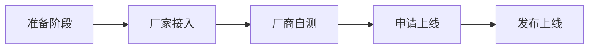

# 智能家居设备接入流程

## 详细介绍

### 准备阶段

申请成为智能家居开发者需要准备：

* 拥有一台若琪设备，可通过 [若琪官网(www.rokid.com)](https://www.rokid.com)或其他线上渠道购买；
* 和商务签订芋头科技 IoT 接入协议，详情请咨询对接商务经理， 点击这里[提交表单](https://www.jiandaoyun.com/f/5bf12d873595611f6478c525)；

### 厂家接入

不管是云云对接，还是局域网对接，都需要遵循若琪智能家居协议，提供设备搜索接口、设备控制接口、设备状态查询接口（可选）。

我们推荐使用 v2 版本协议完成接入：[若琪智能家居协议](../v2/message-reference.md)

#### 云云对接

对于云云对接，我们遵循 OAuth 2.0 协议接入三方用户授权。因此，设备云服务端还需要实现一套标准的 OAuth 2.0 授权机制。

您可以参考以下文档完成云云对接： 

* [OAuth 2.0 协议](../connect/rfc6749.md)
* [云云对接](../connect/cloud-to-cloud.md)

您在真机测试阶段需要将以下信息通过填写 [对接信息表单](http://cn.mikecrm.com/6LU3zsa) 提供给我们：

* 账号授权 URL（适配手机端访问的 OAuth 2.0 授权 H5 页面地址）
* Client ID（为若琪注册生成的客户端 ID）
* Client Secret（为若琪注册生成的客户端秘钥）
* Access Token URL（用于获取 access\_token 的地址）
* 设备指令接受 URL（用于接受若琪设备控制指令的地址）
* 图标 1024\*1024 jpg 格式 方形无圆角
* 厂商名称
* 厂商 app 下载地址 (可选)
* 品牌介绍
    * 支持设备列表
    * 服务联系方式
    * 安装配置说明

您可以参考以下文档完成云云对接： 

* [OAuth 2.0 协议](../connect/rfc6749.md)
* [云云对接](../connect/cloud-to-cloud.md)

#### 局域网对接

对于局域网对接，我们遵循 SSDP 协议实现局域网内的设备自动发现。

您可以参考以下文档完成局域网对接：

* [局域网自动发现](../connect/ssdp-auto-discovery.md)
* [局域网对接](../connect/via-lan.md)

### 厂商自测

我们提供两种测试方式：

##### RHOME 桌面版调试工具

**注意：**支持 v1/v2 两种协议版本！

使用 RHOME 桌面版调试工具，验证设备云服务接口是否正确接入若琪智能家居协议。

您可以参考 [RHOME 桌面版调试工具](../tools/rhome-desktop.md) 文档完成调试。

##### 自定义接入

**注意：**仅支持 v1 协议版本！

使用自定义接入可以很方便的调试开发中的远程驱动，目前支持 HTTP 远程驱动，TCP 远程驱动的调试。

您可以参考 [自定义接入](../tools/developer-driver.md) 文档完成调试。

**注意：**

自测通过之后，请下载测试用例并按模板填写：[测试用例下载](https://s.rokidcdn.com/homebase/upload/HkOw4tzcf.xlsx)

**测试报告要求：**

至少经过一周长稳测试，输出测试报告：[测试报告下载](https://s.rokidcdn.com/homebase/upload/rJXHPX5qm.docx) 附上相关日志。

### 申请上线

将测试报告和测试用例通过邮箱(smarthomeconnect@rokid.com)发送给我们。

### 发布上线

我们会审核表单中信息，并根据测试报告内容进行真机测试验证，预计1-2个工作日可完成发布上线：

## 获取帮助

想要获得更多帮助，可以发邮件到如下商务邮箱：<smarthomeconnect@rokid.com>
