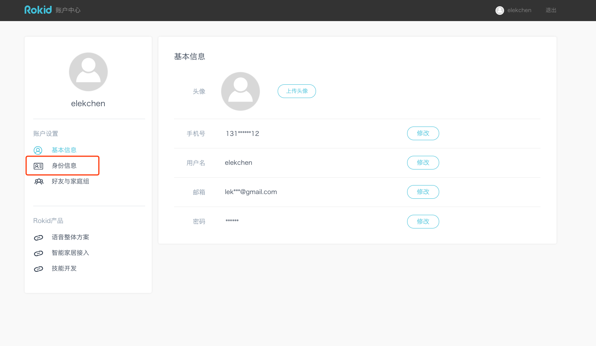

# 智能家居设备接入流程

# 详细介绍

## 准备阶段

申请成为智能家居开发者需要准备：

- 拥有一台若琪设备，可通过 [_若琪官网(www.rokid.com)_](https://www.rokid.com)或其他线上渠道购买；
- 如果您是[_云云对接_](../connect/cloud-to-cloud.md)（**_推荐_**）：
  - 在若琪开放平台注册开发者帐号 [_若琪开放平台_](https://developer.rokid.com/#/)；
  - 注册完成后在个人帐号页面行企业认证（如下图），企业认证所需信息：
  - 企业名称
  - 营业执照编号
  - 营业执照照片
    
- 如果您是 [_局域网对接_](../connect/via-lan.md) 或 [_局域网自动发现_](../connect/ssdp-auto-discovery.md)：
  - 和商务签订芋头科技 IoT 接入协议，详情请咨询对接商务经理， 点击这里 [_提交表单_](https://www.jiandaoyun.com/f/5bf12d873595611f6478c525)；

## 厂家接入

不管是云云对接，还是局域网对接，都需要遵循若琪智能家居协议，提供设备搜索接口、设备控制接口、设备状态查询接口（可选）。

我们推荐使用 v2 版本协议完成接入：[_若琪智能家居协议_](../v2/message-reference.md)

### 云云对接

对于云云对接，我们遵循 OAuth 2.0 协议接入服务方授权。

您可以参考以下文档完成云云对接：

- [_云云对接_](../connect/cloud-to-cloud.md)
- [_OAuth 2.0 协议_](../connect/rfc6749.md)

### 局域网对接

对于局域网对接，我们遵循 SSDP 协议实现局域网内的设备自动发现。

您可以参考以下文档完成局域网对接：

- [_局域网对接_](../connect/via-lan.md)
- [_局域网自动发现_](../connect/ssdp-auto-discovery.md)

## 厂商自测

###**RHOME 桌面调试工具**
使用 RHOME 桌面调试工具，验证设备云服务接口是否正确接入若琪智能家居协议。

您可以参考 [_RHOME 桌面版调试工具文档_](../tools/rhome-desktop.md) 完成调试。

###**自定义接入**
使用自定义接入可以很方便的调试开发中的远程驱动，目前支持 HTTP 远程驱动，TCP 远程驱动的调试。

您可以参考 [_自定义接入文档_](../tools/developer-driver.md) 完成调试。

## 申请上线

自测通过之后，请下载测试用例并按模板填写：[_测试用例下载_](https://s.rokidcdn.com/homebase/upload/HkOw4tzcf.xlsx)

至少经过一周长稳测试，输出测试报告：[_测试报告下载_](https://s.rokidcdn.com/homebase/upload/rJXHPX5qm.docx)

将测试用例和测试报告通过[邮箱](mailto:smarthomeconnect@rokid.com)(_smarthomeconnect@rokid.com_)发送给我们。

## 发布上线

我们会审核表单中信息，并根据测试报告内容进行真机测试验证，预计 1-2 个工作日可完成发布上线。

# 获取帮助

想要获得更多帮助，可以发邮件到如下[邮箱](mailto:smarthomeconnect@rokid.com)(_smarthomeconnect@rokid.com_)。
