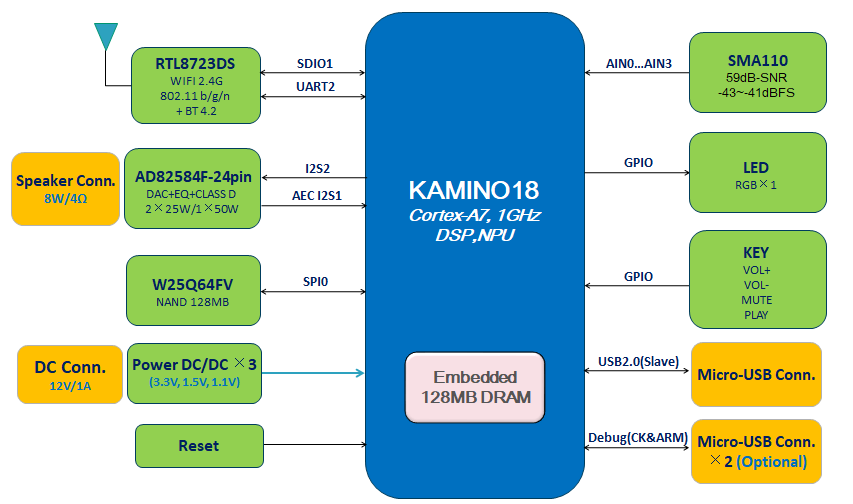

'

ROKID AI DEV HW User Guider
===========================

V3.31

芋头科技（杭州）有限公司

20181010

**版本历史**

| 版本号 | 撰写/修改人 | 日期       | Scope                    |
|--------|-------------|------------|--------------------------|
| V3.31  |             | 2018/10/10 | 适用于ROKID AI DEV V3.31 |

概述
----

### 目的

本文档提供Rokid AI Dev Board v3.31 KAMINO18的硬件连接指南。

### 使用范围

适用于快速导入Rokid AI Dev v3.31平台设计生产智能语音产品。

KAMINO18
--------

### 概述

图 1 KAMINO18系统框图

### 芯片简介

① 支持2/4/6/8路麦克风阵列

② 集成8通道ADC/I2S/PDM，支持模拟麦和数字麦

③ 内置DSP，支持降噪，AEC，Beamforming，去混响等算法

④ 低功耗离线语音激活

⑤ 离线语音识别

⑥ 超低功耗待机，支持电池供电

⑦ 对接主流语音云平台

⑧ Linux操作系统

⑨ 典型配置：128MB SPI NAND Flash + 内置 128MB DDR

ROKID AI DEV V3.31硬件平台简介
------------------------------

### 系统设计框图

图 2 ROKID AI Dev v3.31 系统设计框图

Rokid AI Dev
v3.31平台是面向智能语音产品设计的低成本硬件参考方案。方案采用12V/1A适配器供电，整个方案只需要3颗DCDC就提供了整个系统的供电需要。
由于KAMINO18封装采用了0.8mm pin间距BGA封装，并内置了128MB DDR3，
使得整个方案可以使用2层PCB通孔工艺完成布线，极大地降低了PCBA成本，减少了PCB板子的加工的周期。

Rokid AI Dev v3.31平台采用4颗模拟麦阵列语音输入，采用COB方式的RTL8723DS
WIFI/BT方案，Codec芯片采用ESMT 1×50W单声道驱动能力的AD82584F，并采用IIS
AEC回采方式。通过ADB(USB2.0 Slave)或UART(Micro
USB接口)调试主芯片及各外设，方便用户开发调试。

### 关键器件列表

图 3 关键器件指标

### 硬件开发板接口说明

ROKID AI Dev Board v3.31整机外形图如下：

图 4 ROKID AI Dev v3.31开发板外形

ROKID AI Dev Board v3.31硬件接口如下：

图 5 ROKID AI Dev v3.31 PCBA TOP

ROKID AI Dev v3.31 PCBA TOP层接口定义：

| 序号 | 接口名称  | 说明               |
|------|-----------|--------------------|
| 1    | 播放/暂停 | 音乐播放、暂停按键 |
| 2    | 音量加    | 音量增加按键       |
| 3    | 音量减    | 音量减少按键       |
| 4    | 禁麦按键  | 禁止麦克风按键     |
| 5    | 镜像烧写  | 镜像烧录、升级按键 |

图 6 ROKID AI Dev v3.31 PCBA Bottom

ROKID AI Dev v3.31 PCBA Bottom层接口定义：

| 序号 | 接口名称        | 说明                         |
|------|-----------------|------------------------------|
| 1    | DC适配器连接器  | 12V/1A DC适配器接口          |
| 2    | SPEAKER连接器   | 音腔连接器                   |
| 3    | Micro USB连接器 | USB Slave micro USB 接口     |
| 4    | ARM 调试口      | ARM UART信号，micro USB 接口 |
| 5    | CK 调试口       | CK UART信号，micro USB 接口  |

开发板使用说明
--------------

### 开机

ROKID AI Dev v3.31开发板外部连接非常简单，插入12V/1A DC 适配器即自动开机。

### 烧写Image与SN

1.  安装设备驱动，安装文件和说明在leo-k18-universal-glibc/bootx_win/driver_install目录下

2.  将microUSB 线一端连到开发板USB Slave接口，另一端插入PC；

3.  按下开发板上的BOOT按键，然后插入12V/1A
    适配器。此时，PC端设备管理器里会出现一个Nationalchip
    Storage设备带黄色感叹号安装驱动；

打开镜像烧写工具安装包找到 zadig-2.3.exe

点击安装。此时可以释放BOOT按键。

等待几分钟，安装完成

驱动安装完毕后，出现新的存储设备。

1.  烧写镜像

2.  打开WINDOWS镜像烧写工具 NCDownloader.exe，配置文件烧写路径，完成后保存。

1.  按下BOOT按键，重新插拔一次12V/1A DC适配器，然后点击 开始烧写(F5)

此时，可以释放BOOT按键，烧写过程会继续，直到烧写完成。

1.  烧写SN

2.  将microUSB 线一端连到开发板USB Slave接口，另一端插入PC；

3.  插入12V/1A 适配器，开发板自动开机；

4.  Windows运行界面输入”cmd”，进入命令提示符界面：

1.  输入”adb shell” –\> “factory 0 0”, 开发板会重启，进入FTM模式

1.  开发板重启完成后，再次输入”adb shell”

1.  依次输入 ”factory 9 1 SEED”

>   \-\> “factory 9 3 SN”

>   \-\> “factory 9 5 ID”, 完成SN的烧录。

1.  烧写完成SN之后，一定要输入 “factory 0 3”，退出FTM模式。

1.  至此，SN烧录步骤完成。设备自动重启，进入配网模式。

还有其他问题可以参考
[**Linux烧写工具使用**](https://developer.rokid.com/docs/7-bspguide/jing_xiang_shao_xie/linuxshao_xie_gong_ju_shi_yong.html)
[**Windows烧写工具使用**](https://developer.rokid.com/docs/7-bspguide/jing_xiang_shao_xie/windowsshao_xie_gong_ju_shi_yong.html)
[**工厂烧写工具使用**](https://developer.rokid.com/docs/7-bspguide/jing_xiang_shao_xie/gong_chang_shao_xie_gong_ju_shi_yong.html)
