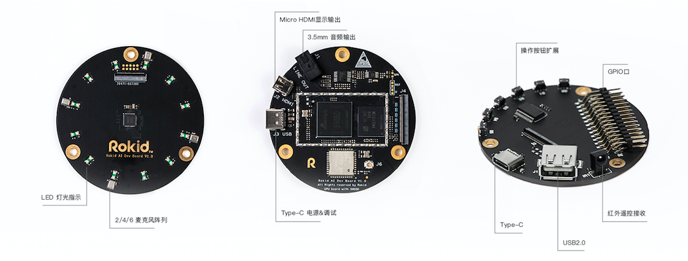

### 智能开发套件简介
智能开发套件是一套完整的语音整体解决方案，搭载了包括麦克风阵列、CPU、GPU 和信号处理在内完整硬件配置，并配备了 3.5mm 音频接口、Micro HDMI、Type-C 等丰富接口。目前已经开发出两套分别搭载 Linux 和 Android 操作系统的开发套件，70% 操作系统和框架代码，100% 的 EE 和 ME 设计全部免费，用户可根据需要选择阿里云或 Rokid 的语音服务，双方共享海量语音技能，完全开放给开发者及合作伙伴使用。

智能开发套件如下图所示：

智能开发套件的优势：
- **强劲性能**
 - Amlogic S905D CPU  
   - 4核A53.主频1.5G
 - 2G RAM + 16G ROM
 - IIS Mic  4/ 6  
   - 信噪比65db, 灵敏度-26db
 - Android 6.0/7.0
 - Linux

- **完整接口**
 - LED 灯光阵列
 - MIC 阵列（4/6 MIC）
 - 3.5mm 音频输出
 - Micro HDMI 显示输出
 - Type-C 电源/串口调试

- **丰富扩展**
 - GPIO
 - I2C
 - SPI
 - UART
 - 红外接收器
 - USB 2.0*2

- **极致之美**
 - 向工程师致敬
 - 精简、漂亮、强劲、完整

- **全栈开放**
 - E.E/M.E 参考设计
 - A.I.端计算架构（信号处理/唤醒/寻向/….）
 - A.I. enable Operating System (Linux or Android)
 - A.I. 计算服务（ASR/TTS/NLP/Voice ID/）
 - IOT Cloud
 - A.I. Skill Cloud
 - 内容、服务（音乐、新闻、天气、百科、翻译、购物等）

- **极致开源**
 - Open for free
 - 70% 操作系统和框架代码
 - 100%E.E 、M.E 设计

- **行业应用**
 - 智能音箱
 - 玩具
 - 车载
 - 电视
 - 机顶盒
 - ...