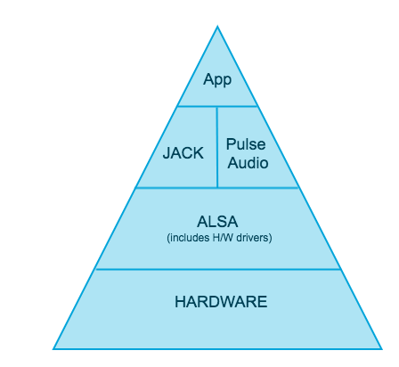

# RokidOS 中的音频框架

RokidOS 目前使用 PulseAudio 作为我们的基础音频系统，在 PulseAudio 框架的基础上，我们做了一些开发和封装，构建在 PulseAudio 之上的关键模块、服务有：TTS服务、系统音量控制、媒体播放器等。

对于 PulseAudio 框架比较陌生的开发者，通过阅读以下章节，增进了解。

## 什么是音频框架

大家都知道操作系统是非常复杂的，就像播放声音和录取声音这样看起来很简单的操作，都需要很多层的应用交互下才能完成。在软件中，框架可以看成许多应用的集合，这些应用没有任何功能，直到用户赋予其功能。音频框架也一样，直到应用让它开始播放声音，它才发挥作用。如下图所示，为 RokidOS 中的音频框架图，框架图中的每一层后面我们都将进行介绍：

## 为什么需要音频框架

让系统发出声音来是需要非常多的代码，而每个应用程序并不想重复造轮子。为了解决这个问题，操作系统就提供了一个音频框架，这样它就可以被所有应用程序共享。如果一个应用程序要播放声音，它只需要调用音频框架提供的播放接口，就可以顺利播放出声音了。一个好的音频框架需要低延时和高度自动兼容性，并不需要用户去设定播放频率。

## 音频硬件驱动接口在音频框架中作什么

上面我们一直在介绍音频框架，驱动在哪里呢？在我们这里，驱动被包含在 [ALSA](https://zh.wikipedia.org/wiki/ALSA) 层中。驱动故名思义，就是它能告诉我们声卡有哪些功能，有多少输入输出。对于大部分硬件音频接口，都有通用的驱动，当然如果您需要特别低的延迟特别高的性能，这时您就得使用定制化的驱动。

## ALSA 接口与 Pulse Audio 或 Jack 的交互

在 Linux 中，所有的硬件驱动都被编译进内核中，并在软件包中提供。所有的音频接口驱动都放在 ALSA（ Linux 高级音频框架）中，ALSA 还为 [PulseAudio](https://wiki.archlinux.org/index.php/PulseAudio) 和 [Jack](https://wiki.archlinux.org/index.php/JACK_Audio_Connection_Kit) 等上层软件提供交互接口。

## PulseAudio 和 Jack 本质

PulseAudio 和 Jack 技术上称为“声音服务”，它们可以发送和接收不同应用程序的许多音频通道。任何需要通过 ALSA 接口来使用音频的应用，一般都会使用 PulseAudio 或者 JACK，据统计有99%的现代通用音频应用都使用的是 PulseAuido，其他特殊的音频应用使用的是 JACK。

## JACK Audio Connection Kit

我们目前还没考虑在 RokidOS 系统上支持 Jack Audio 框架。

