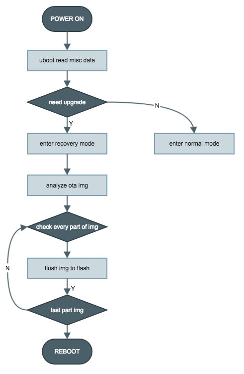

# 系统升级

RokidOS 为第三方厂商提供了 OTA 相关方案。

## 系统分区

由于文件系统的问题，线刷的固件包为**aml_upgrade_package.img**，而 OTA 所使用的固件包为**rokid_upgrade_package.img**，二者打包格式不同在于 system 分区的不同。

对于采用 Amlogic 公司芯片方案，系统分区如下:

1. uboot;
2. dtb (隐藏分区)；
3. misc;
4. boot(kernel);
5. recovery;
6. data;
 

如果开发者或者第三方厂商需要修改系统分区，需要修改分区大小，则需要更改 kernel 代码 dts 和对应 uboot 代码。以 Amlogic/A113 开发板来讲(其余开发板到[开发板用户手册](../../reference/dev_board/board_list.md))查询参考，对应代码路径如下：

```shell
# dts

kernel/aml-4.9/arch/arm64/boot/dts/rokid/banban_m_a113.dts

# uboot

board/amlogic/axg_s420_v1/axg_s420_v1.c
```

## 升级流程
流程图如下：



具体操作分析如下：

1. 设备通过网络协议获取网络 OTA 升级包(rokid_upgrade_package.img)，存储在 data 分区；并设置升级参数到 misc 分区后设备 reboot，具体参数如下：
2. 重启后，进入 uboot 状态，uboot 读取 misc 分区的标志位，如果判断是升级模式，会把 recovery 加载到内存中，跳转到 recovery 分区，并修改 bootcmds。
3. recovery 分区相当于 Linux 内核+ramfsdist，启动 init  进程，读取 bootcmds 后会执行打包在 ramfslist 中 unpack 进程；
4. unpack 进程会挂载 data 分区， 后读取 bootcmds 结构体，开始解析升级包，以此烧写到对应分区，烧写完成后，重启设备；


