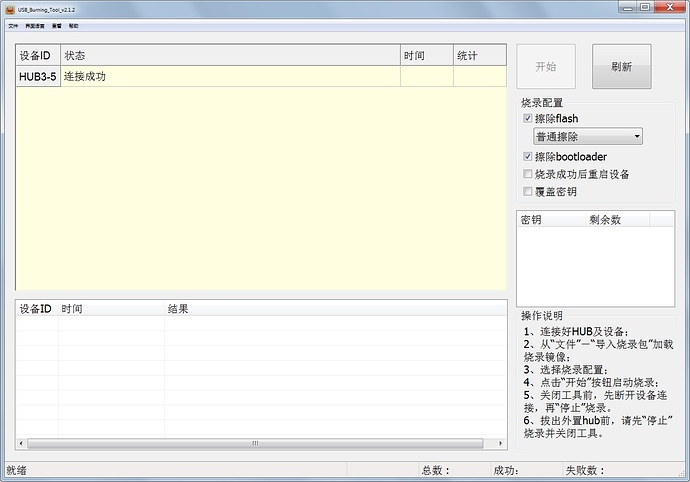

# 刷机说明


### Amlogic芯片

#### 生成的镜像位置<br>
1. Android 系统<br>
	如果您的开发板是Android系统，请参考Android开发文档来了解Android系统生成的系统镜像的位置。<br>
2. RokidOS 系统（即Linux系统）<br>
	如果您的开发板是Linux系统，镜像位置及各** img **文件简单说明如下，该示例仅保证Amlogic/A113开发板有效。
```
output/<开发板型号>/images
    ├── aml_upgrade_package.conf   #<< 分区配置信息
    ├── aml_upgrade_package.img    #<< Amlogic 官方工具刷机包
    ├── boot.img                   #<< 可 fastboot 刷机镜像，kernel、ramdisk 分区
    ├── dtb.img -> ./banban_m_a113.dtb  #<< 可 fastboot 刷机镜像，这是一个软链接，实际刷机时用指向的镜像
    ├── banban_m_a113.dtb
    ├── recovery.img               #<< 可 fastboot 刷机镜像，OTA 功能主体
    ├── rokid_upgrade_package.conf #<< 仅用于 OTA 升级，指示分区信息，刷机不需要
    ├── rokid_upgrade_package.img  #<< 后台 OTA 升级的镜像，刷机不需要
    ├── rootfs.ubi                 #<< 可 fastboot 刷机镜像，系统分区用这个镜像，该镜像没有做过压缩
    ├── rootfs.ubifs               #<< 注意: 根据您使用的
    ├── u-boot.bin                 #<< 可 fastboot 刷机镜像，bootloader 分区
```

 **一、官方刷机方式**
 1. 安装 [Amlogic 官方刷机工具](https://scm-deps-library.rokid-inc.com/linux/buildroot_dl_aml/tools/aml_burn_img_tool_v2.1.2.exe)<br>
	具体安装步骤，请参阅 [Amlogic 官方刷机工具使用教程](http://localhost:4000/rokidos-linux-docs/files/amlogic/AmlUSBBurning.pdf)。<br>
	
 2. 选择刷机镜像<br>
    打开Amlogic 刷机工具，选择菜单中的"**文件**"->"**导入烧录包**"，在弹出的文件对话框中选择 "**aml_upgrade_package.img**" 文件。
 3. 进入刷机模式<br>
	首先：开发板核心板 **TypeC** 接口与 **PC** 已连接。<br><br>
	- 方法一：接上开发板配套的 **Debug 板**，同时按住** Debug 板**上的 <**upgrade**> 和 <**reset**> 键几秒后松开，刷机工具界面出现 **连接成功**，即表示开发板已经进入刷机模式。<br><br>
	
	**千万注意：如果使用A113的开发板，刷机时，在“擦除Flash”处不能勾选“擦除所有”和“强制擦除所有”.**
	- 方法二：通过 Debug 板上的 **TypeC** 连接串口线，进入u-boot，输入```update```，您将看到刷机工具界面出现**连接成功**，表示开发板已经进入刷机模式。<br><br>
	- 方法三：如果您的开发板系统是 **Android** 系统，``` adb shell reboot update```，您将看到刷机界面出现**连接成功**，表示开发板已经进入刷机模式。<br><br>
 4. 开始刷机<br>
	点击刷机工具中的"**开始**"按钮，开始刷机，并等待刷机完成，请按照刷机工具中的提示操作。<br>

 **二、fastboot 刷机方式**
 1. 进入 fastboot 模式<br>
	首先：开发板核心板 **TypeC** 接口与 **PC** 已连接。<br><br>
	- 方法一：通过 Debug 板上的 **TypeC** 连接串口线，进入u-boot，输入`fastboot`，开发板会进入fastboot模式。<br><br>
	- 方法二：如果您的开发板系统是 **Android** 系统，`adb shell reboot fastboot`，开发板会进入fastboot模式。<br><br>
 2. 刷机指令<br>
	* 镜像文件与设备分区的对应关系<br>
		Amlogic芯片的开发板，您可以通过查看** aml_upgrade_package.conf **文件内容，如`cat aml_upgrade_package.conf`，来找到一些线索。
		
		``` shell
		#This file define how pack aml_upgrade_package image

		[LIST_NORMAL]
		#partition images, don't need verfiy
		file="u-boot.bin.usb.bl2"   main_type= "USB"            sub_type="DDR"
		file="u-boot.bin.usb.tpl"   main_type= "USB"            sub_type="UBOOT"
		file="u-boot.bin.sd.bin"    main_type="UBOOT"           sub_type="aml_sdc_burn"
		file="platform.conf"        main_type= "conf"           sub_type="platform"
		file="aml_sdc_burn.ini"     main_type="ini"             sub_type="aml_sdc_burn"
		file="dtb.img"              main_type="dtb"             sub_type="meson1"

		[LIST_VERIFY]
		#partition images with verify
		file="boot.img"             main_type="PARTITION"       sub_type="boot"
		file="recovery.img"         main_type="PARTITION"       sub_type="recovery"
		file="rootfs.ubifs"         main_type="PARTITION"       sub_type="system"    file_type="ubifs"
		file="u-boot.bin"           main_type="PARTITION"       sub_type="bootloader"
		file="dtb.img"              main_type="PARTITION"       sub_type="_aml_dtb"
		```

		* 开发板是 Linux 系统<br>
		在PC端执行如下指令：
		(注意 A113 开发板使用 fastboot，需要先做擦除动作,如擦除 boot 分区，fastboot erase boot，并且 dtb 暂时不能单独烧录)
		```
		fastboot flash bootloader u-boot.bin
		fastboot flash dtb <开发板型号>.dtb
		fastboot flash boot boot.img
		fastboot flash system rootfs.ubifs
		fastboot flash recovery recovery.img
		```	
		* 开发板是 Android 系统<br>
		在PC端执行如下指令：
		```
		fastboot flash bootloader u-boot.bin
		fastboot flash dtb dtb.img
		fastboot flash boot boot.img
		fastboot flash system system.img
		fastboot flash recovery recovery.img
		fastboot flash data userdata.img
		```

### 其他芯片

## 开发板镜像下载地址
- Linux镜像下载地址：[linux](https://developer-forum.rokid.com/t/topic/1152)
- Android镜像下载地址：[android](https://developer-forum.rokid.com/t/topic/1178)

首先要查看开发板套件上的麦克风板是 6mic 还是 4mic，CPU 是 A113 (Linux)还是 905D(Android/Linux)
镜像地址直接拷贝到浏览器即可下载。


