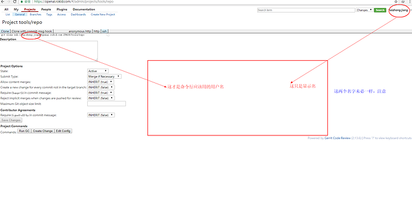

# 下载源代码

我们使用Google公司的Gerrit系统来管理我们的 RokidOS 源代码。

对外开放的 RokidOS 源代码，每天凌晨4点自动同步。

## 注册成为 Rokid 平台开发者
1. 登录方式<br>
登录 [openai.rokid.com](http://openai.rokid.com) ，会统一跳转到 [Rokid开发者网站](https://developer-account.rokid.com) 进行授权认证（如果是未注册用户，请先注册），登录后会跳转到 gerrit 页面，右上角就是登录用户名。
**注意：Rokid 开放平台的用户名不能出现中文，可在[用户基本信息](https://account.rokid.com/#/setting/base)中修改

2. 代码访问权限说明<br>
gerrit 服务仅开放 ssh 方式下载，所以必须先将你机器的公钥 添加到你个人账号下（右上角账号->Settings->ssh public keys->add key）。
目前 Rokid 对外开放的代码，分两种：<br>
  - 只要是注册用户就可以下载代码。<br>
  - 必须进行特定的授权后才可以下载。<br>

**注意：下载代码 *账号名* 不一定是右上角所显示那个 *用户名*，您的账号可以通过：**[https://openai.rokid.com/#/admin/projects/tools/repo](https://openai.rokid.com/#/admin/projects/tools/repo)下的【ssh】tab中的显示 *账号* 获知。


## 安装repo 工具

1. 确保主目录下有一个 bin/ 目录，并且该目录包含在路径中：
```
$ mkdir ~/bin
$ PATH=~/bin:$PATH
```
2. 根据您的办公网络情况，获取 repo 工具。
	* 可以翻墙 

		如果您的办公环境可以翻墙访问 Google 网站，您可以使用Google 官方发行的 repo 工具。
		```
		$ curl https://storage.googleapis.com/git-repo-downloads/repo > ~/bin/repo
		$ chmod a+x ~/bin/repo
		```

	* 不能翻墙

		如果您的办公环境不能访问 Google 网站，您可以使用Rokid 修正版的 repo 工具。
		```
		$ curl https://scm-deps-library.rokid-inc.com/linux/buildroot_dl_aml/tools/repo > ~/bin/repo
		$ chmod a+x ~/bin/repo
		```
	
## 初始化 repo 客户端

需要根据您的开发板的芯片厂商来选择具体的代码下载库，各类支持 RokidOS 的开发板，请到[开发板用户手册](../../reference/dev_board/board_list.html)章节查询参考。

**以下示例同步的代码仅保证支持Amlogic-A113开发板。**

* 运行repo init
	* repo 是Google官方版本

	```
	repo init -u ssh://your-account@openai.rokid.com:29418/amlogic_a113_audio/manifest -m rokidbase.xml
	```

	* repo 是Rokid 修正版本

	```
	repo init -u ssh://your-account@openai.rokid.com:29418/amlogic_a113_audio/manifest -m rokidbase.xml --repo-url=ssh://your-account@openai.rokid.com:29418/tools/repo --no-repo-verify
	```

* 下载RokidOS 代码树
	```
	repo sync
	```
