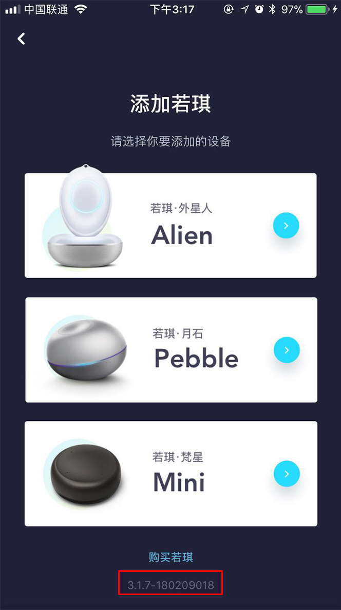
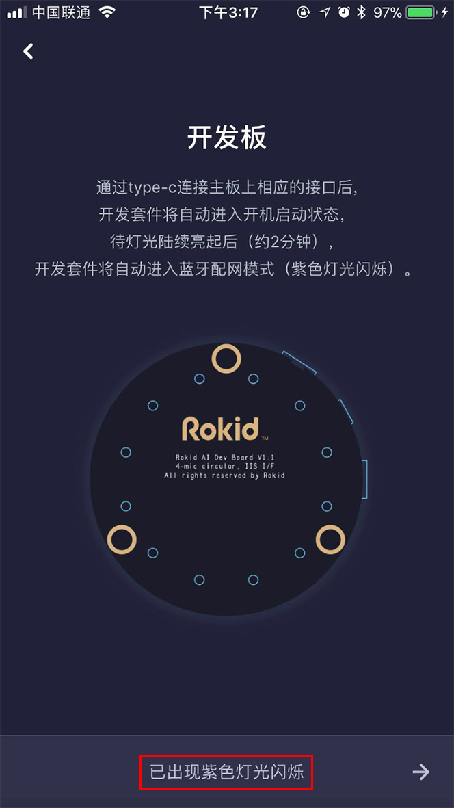
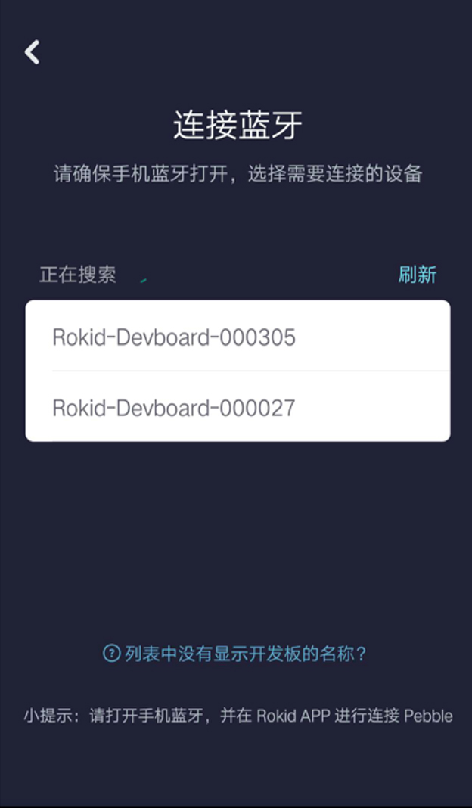
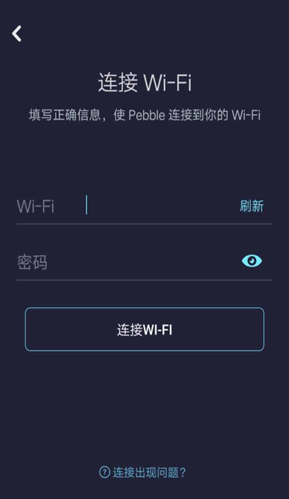
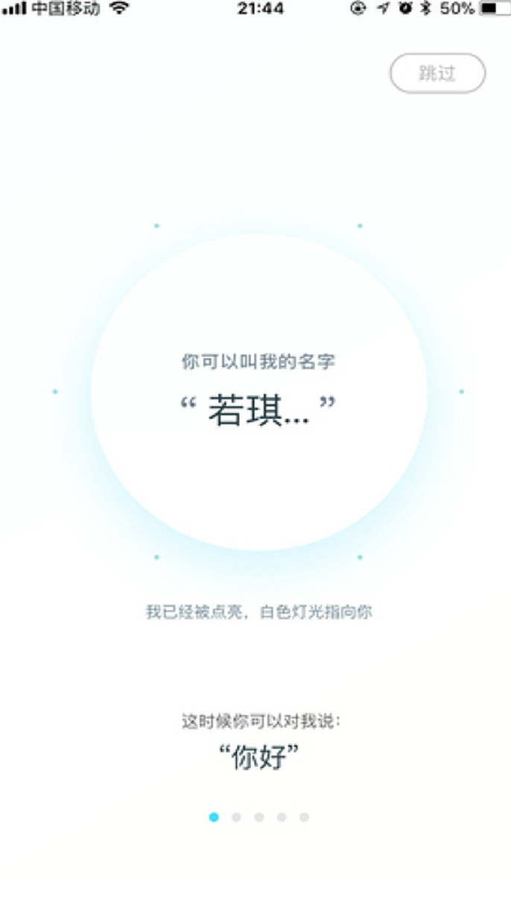

### 网络接入配置

网络配置是必须做的，因为我们的设备是基于云端语音服务的交互设备，网络接入是保证系统正常工作的基础。
这里介绍如何配置网络，主要分为蓝牙配网和手动配网。

#### 蓝牙配网

> 注意：蓝牙配网所使用的是 BLE 协议，因此手机自带的系统蓝牙无法进行搜索，请使用 RokidApp 或者集成了 BLE 协议的软件。

##### 第一步

开发板核心板 TypeC 接口与 PC 连接。

##### 第二步

下载 [Rokid 官方手机App](http://s.rokidcdn.com/app/m_index.html)，安装后，打开 App，点击左上角，找到“若琪设置”==>“添加新设备”，如下图：
下载 Rokid APP，安装后，打开 APP 并登录后，若当前账号无绑定的设备则直接跳转到添加新设备页面。

##### 第三步

在图中红框处, 点击5次，进入开发板蓝牙配网界面，即可开始配网。

	

##### 第四步

待灯光陆续亮起后（约两分钟），开发套件将自动进入蓝牙配网模式。点击「已出现紫色灯光闪烁」进入下一步。



##### 第五步

确保手机蓝牙打开，选择需连接的设备。可根据开发套件CPU上的SN号来区别设备。若设备为搜索不到蓝牙，可对设备说“若琪若琪”。



##### 第六步

输入无线网络的账户和密码，点击「连接WIFI」。


	

##### 第七步

配网成功如下图所示：



#### 手动配网

通过执行以下五个步骤进行配网，然后 ifconfig 查看是否获得 ip 地址。
##### 1）adb shell 登录 RokidOS

##### 2）vi /data/system/wpa_supplicant.conf

```
	ctrl_interface=/var/run/wpa_supplicant
	ap_scan=1
	update_config=1
	network={
        	ssid="wifi名"
		psk="wifi密码"
	}
```
##### 3）sync

##### 4）wpa_cli reconfigure

##### 5）systemctl restart dhcpcd