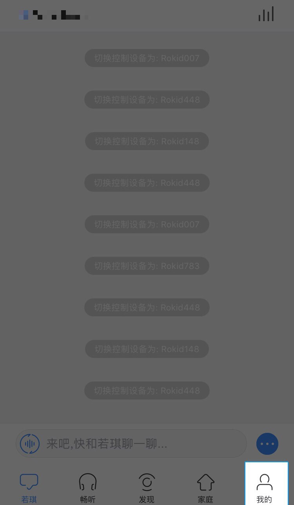
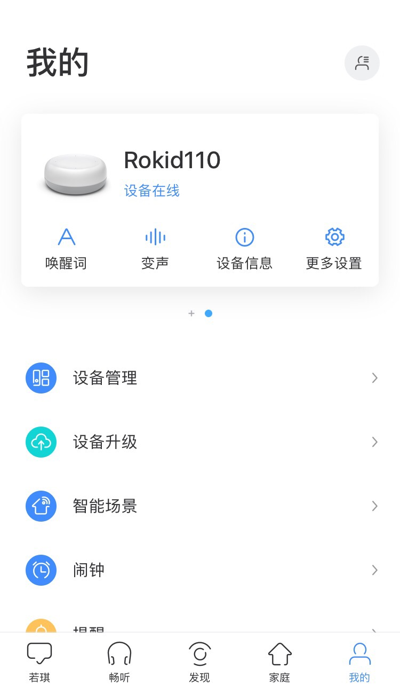
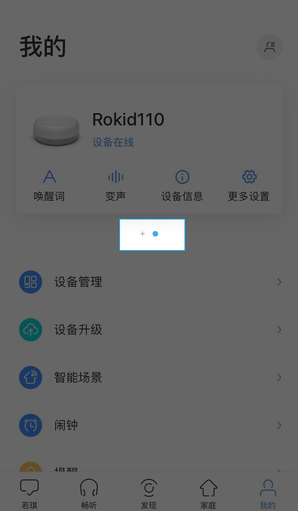
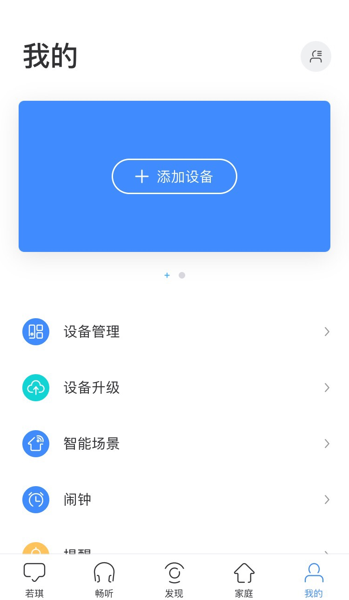

## 网络接入配置

网络配置是必须做的，因为我们的设备是基于云端语音服务的交互设备，网络接入是保证系统正常工作的基础。
这里介绍如何配置网络，主要分为蓝牙配网和手动配网。

### 蓝牙配网
> 注意：蓝牙配网所使用的是 BLE 协议，因此手机自带的系统蓝牙无法进行搜索，请使用 RokidApp 或者集成了 BLE 协议的软件。

#### 一、首次使用RokidApp配网

第一步：开发板核心板 TypeC 接口与 PC 连接。

第二步：下载 [Rokid 官方手机App](http://s.rokidcdn.com/app/m_index.html)，安装后，打开 App，注册账号并登录。

第三步：登录成功后，会进入【欢迎使用若琪】页面，并提示打开手机蓝牙。请按提示打开手机蓝牙，点击【我知道了】。

第四步：打开蓝牙以后，在欢迎页面底部会出现【发现可连接音箱】的字样，点击它会跳出可连接的设备（开发板对应的名称前缀为Devboard）。或者也可以点击“欢迎使用若琪”5下，就可以进入开发板的配网模式，如下图所示。

第五步：点击【立即连接】进入网络配置页面，输入Wi-Fi名称和密码，并点击“发送到音箱”。随后等待连接完成即可。


#### 二、已有绑定设备的情况下配网

第一步：开发板核心板 TypeC 接口与 PC 连接。

第二步：下载 [Rokid 官方手机App](http://s.rokidcdn.com/app/m_index.html)，安装后打开 App并登录。

第三步：登录App后，进入【我的】界面。如下图所示。

	


	


第四步：点击设备卡片下方的加号【+】，随后点击【添加设备】。如下图所示。
	

	


第五步：随后进入【欢迎使用若琪】页面，进行网络连接。 

1）若未打开蓝牙，App会提示您打开手机蓝牙。

2）若已打开手机蓝牙，App会自动跳出可连接的设备（开发板对应的名称前缀为Devboard）。

3）点击【立即连接】进入网络配置页面，输入Wi-Fi名称和密码，并点击“发送到音箱”。随后等待连接完成即可。


### 手动配网

通过执行以下五个步骤进行配网，然后 ifconfig 查看是否获得 ip 地址。
1. adb shell 登录 RokidOS
2. vi /data/system/wpa_supplicant.conf
```
	ctrl_interface=/var/run/wpa_supplicant
	ap_scan=1
	update_config=1
	network={
        	ssid="wifi名"
		psk="wifi密码"
	}
```
3. sync
4. wpa_cli reconfigure
5. systemctl restart dhcpcd
